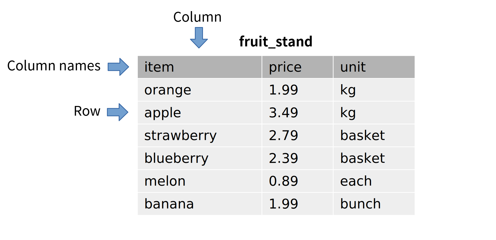

.. _basics-chapter:

======
Basics
======

Part 1 of this book is all about SQL, the most popular language used for interacting with *relational databases*, the main focus of the book.  (We will talk more about the difference between relational and other databases in :numref:`Part {number} <relational-theory-part>`.)  The goal of this chapter is to introduce the most simple features of relational databases and SQL.  You will learn how to get data out of the database, and how to get data into the database, and how to use this textbook's interactive features.

.. index::
    single: table; defined
    single: column; defined

Tables
::::::

While relational databases can contain many types of *objects*, the object type that stores data is the *table*.  Each table in the database has a name, which usually provides some indication of what kind of data can be found in the table.  The table structure is defined by the table's *columns*, each of which has a name and an associated data type.  The actual data is contained in the *rows* of the table; each row is one data point and has a value for each column of the table.

We can visualize a simple table as, well, a table:

The illustration above shows a table named "fruit_stand" with three columns named "item", "price", and "unit".  Although the illustration does not show the data types, we might infer that the **item** and **unit** columns contain text and the **price** column contains decimal numbers.  Each row of **fruit_stand** contains information about one kind of fruit sold at the fruit stand.

.. index::
    single: SQL
    see: Structured Query Language; SQL
    single: query language

Structured Query Language (SQL)
:::::::::::::::::::::::::::::::

An important characteristic of modern databases is that they abstract low-level operations on files, tables, indexes and so forth into high-level requests to the database management system (DBMS).  Requests to the database are typically expressed in a *query language*.  Query languages are a type of programming language, but are different from most in that query languages tend to be declarative rather than imperative.  Whereas imperative languages require the programmer to specify exactly what steps to take to perform a task, declarative languages simply describe a desired outcome.

Structured query language (SQL) is the most popular query language for relational databases, and is an example of a declarative language.  SQL was developed by engineers at IBM in the 1970s and was standardized by standards organizations ANSI and ISO starting in 1986, with regular updates.  New features continue to be added to SQL as relational database technology and applications evolve.

Even though a standard exists for SQL, relational databases have slightly different implementations of the relational model, and similarly different "dialects" of SQL.  Despite these differences, most SQL dialects share enough in common that, with care, highly portable SQL code can be written.  Examples in this textbook use the SQLite database engine, and thus the dialect of SQL used by SQLite.  To the extent possible, however, examples will be portable to other dialects; where there are significant differences between implementations, these will be noted.  Due to the large number of relational DBMSes available, only a few highly popular DBMSes are included:  SQLite, PostgreSQL, MySQL, Oracle, and Microsoft SQL Server.

SQLite examples can be run directly inside this online textbook (more on this below).  :ref:`Appendix A <appendix-a>` provides SQL scripts to create the database used in this book for each of the database engines listed above.

..
  .. index::
      see: DQL; data query language
      single: data query language
      see: DML; data manipulation language
      single: data manipulation language
      see: DDL; data definition language
      single: data definition language
      see: DCL; data control language
      single: data control language

  SQL is sometimes subdivided into smaller languages focused on particular tasks: a data query language (DQL) for retrieving data, a data manipulation language (DML) for modifying data, a data definition language (DDL) for defining and modifying database objects, and a data control language (DCL) for managing authorization and access to data.  These distinctions are largely unimportant, and will not be used in this textbook.

The basic element of SQL is the *statement* or *query*.  While a distinction can be made between these two (statements acting to change the state of the database, queries acting to retrieve data), it is common to use the terms interchangeably.  Statements in SQL read much like English sentences, although with very strict rules.

SQL is often pronounced as "sequel", although it is equally valid to simply say each letter.

.. index:: SELECT, FROM, clause

Retrieving data using SELECT
::::::::::::::::::::::::::::

In its simplest form, the **SELECT** statement can be used to retrieve all data from a table.  We just need to know the table name:

::

    SELECT * FROM fruit_stand;

Here, **fruit_stand** is the name of the table.  The **\*** is a special symbol used with **SELECT** statements to mean "all columns in the table".  The table **fruit_stand** is one table in the example database for this textbook. The interactive example below will let you query this database; the query above is already set up for you - click on "Run" to see what it results in.  The column names for the table are shown across the top of the result table.

.. activecode:: sql_basics_example_select
    :language: sql
    :dburl: /_static/textbook.sqlite3

    SELECT * FROM fruit_stand;

The statement (or query) above is said to have two *clauses*; a clause is a part of a SQL statement, usually starting with a SQL keyword.  The two clauses in the statement above are the **SELECT** clause, "SELECT \*" and the **FROM** clause, "FROM fruit_stand".  Most clauses are optional, in the sense that they are not required in every query, although they will be necessary to produce certain desired results.

Retrieving specific columns
---------------------------

Above, we retrieved all columns of a table, which may not be the desired result.  We can specify the columns we wish to retrieve, and in what order, by replacing the **\*** in our **SELECT** clause with a comma-separated list of columns:

::

    SELECT price, item FROM fruit_stand;

You can paste this new query into the interactive tool above to see its result.

Looking ahead
-------------

There is a lot more we can do with a **SELECT** query, which will be explored in future chapters.  In :numref:`Chapter {number} <data-retrieval-chapter>`, we will discuss basic usage of **SELECT**, including how to retrieve specific subsets of rows and how to sort rows.  In :numref:`Chapter {number} <expressions-chapter>`, we will delve deeper into the types of values and expressions you can use in SQL queries.  In :numref:`Chapter {number} <joins-chapter>`, we look at connecting multiple tables in a query to retrieve more complex results.  Even more advanced topics will be explored in later chapters.

Creating tables and adding data
:::::::::::::::::::::::::::::::

Of course, before you can retrieve data from a database, you need to get data into it.  First, we need to define a table structure.  We do this with a **CREATE TABLE** statement.  The **fruit_stand** table above was created using this statement:

::

    CREATE TABLE fruit_stand (
      item TEXT,
      price NUMERIC,
      unit TEXT
    );

When defining a table in SQL, you list the columns you want, giving the name and the data type of the column.  Try creating a new table, **my_purchase**, in the database using the interactive tool below:

.. activecode:: sql_basics_example_create
    :language: sql
    :dburl: /_static/textbook.sqlite3

    CREATE TABLE my_purchase (
      item TEXT,
      quantity NUMERIC,
      total_price NUMERIC
    );

As soon as you create this table, you can query it using **SELECT**.  However, there will not be any data in the table yet.  To add data to the table, use **INSERT** statements:

::

    INSERT INTO my_purchase VALUES ('apple', 2, 6.98);
    INSERT INTO my_purchase VALUES ('melon', 1, 0.89);

Try adding some data to the **my_purchase** table, and then retrieve it using **SELECT**.  You can also add data to the **fruit_stand** table, or try creating your own tables and adding data to them.  Be sure to use single quotes around any string values you put into a table.

We should note, at this point, that the data types we have used here are not standard SQL.  They are supported by SQLite, the database implementation used in this online textbook. We have used them here for simplicity, but a full discussion of SQL data types and table creation will have to wait until :numref:`Chapter {number} <table-creation-chapter>`.

Looking ahead
-------------

Table definitions can include much more than simple lists of columns.  We will discuss the complexities of table construction in :numref:`Chapter {number} <table-creation-chapter>`.  Likewise, above we only showed the most basic form of the **INSERT** statement.  We will discuss **INSERT** in more detail in :numref:`Chapter {number} <data-modification-chapter>`; in the same chapter, we will discuss how to remove rows from a table and how to modify row data.

SQL statement rules and conventions
:::::::::::::::::::::::::::::::::::

First, note that SQL statements are properly terminated by semicolons.  In some software tools, single statements are allowed to be unterminated - this is true in our interactive examples, in fact.  However, we will always show the semicolon in our examples, as they become very important in settings where you want to send a list of statements to the database at one time.

One implication of this is that it is entirely permissible and (in many cases preferable, as in our **CREATE TABLE** examples) to write statements on multiple lines.  The query below is correct, and equivalent to the same query expressed all on one line:

::

    SELECT *
    FROM fruit_stand;

Next, SQL keywords are case-insensitive.  That is, we can write:

::

    select * from fruit_stand;
    Select * From fruit_stand;
    select * FROM fruit_stand;

and get the same result for each query.  In the examples in this book, the convention is that SQL keywords will be capitalized.

To some extent, the names of things (tables, columns, functions, etc.) also act as if they are case-insensitive.  However, the behavior here varies among databases.  We'll explore more on this topic in :numref:`Chapter {number} <joins-chapter>`.  A fairly common convention is to always put the names of things in lowercase.  The examples in this book will follow that convention, which will help distinguish keywords from things that exist in the database.

Note the conventions used in this textbook may be different from those used by your teacher, at your place of work, or in code found on the internet!

.. index:: comments

Comments
::::::::

SQL provides for two types of comments, which we will occasionally use to annotate queries in this book.  Multi-line comments are any text between `/*` and `*/`.  Single-line comments start with two dashes.  Here is a query using both types of comment:

::

    SELECT *
    /* here is a
       multi-line comment */
    FROM      -- single-line comment
      fruit_stand;

Interactive examples
::::::::::::::::::::

The interactive tools in this chapter are all connected to the same database, which is the example database that will be used throughout the book. If you make a table, or modify data, you can see the result of the changes in any interactive tool on the same page.  It is important to note, however, that you are just working with a copy of the database that is created and loaded into your web browser whenever you view the page.  Any changes you make will disappear as soon as you go to another chapter in the book or close your web browser.

The good news is that this means you can experiment as much as you want with the book's database - you cannot harm anything.  We strongly encourage you to try all of the examples, as well as to try out your own ideas.  The more time you spend "playing" in the database, the more you will learn.

The bad news is that any queries you create will disappear when you leave the page.  If you work on anything complex, or anything that you want to return to, you may want to copy it to a separate document on your computer.  You can also save code in the "Scratch ActiveCode" tool - click on the pencil at the top of the page to get to the tool.  Note that the scratch tool is not connected to the same database, but instead uses an empty database.

As you work through this textbook, there will be frequent interactive examples based on various tables in the database.  The available tables are described in more detail in :ref:`Appendix A <appendix-a>`.  You can also query the database to learn about its tables.  To get a list of available tables, do:

.. activecode:: sql_basics_example_catalog
    :language: sql
    :dburl: /_static/textbook.sqlite3

    SELECT name FROM sqlite_master WHERE type = 'table';

You can see the table definition in addition to the name if you do

::

    SELECT name, sql FROM sqlite_master WHERE type = 'table';

.. |chapter-end| unicode:: U+274F

|chapter-end|

.. raw:: html

   

   
    <i>A Practical Introduction to Databases</i> by
   
   Christopher Painter-Wakefield is licensed under a
   <a rel="license" href="http://creativecommons.org/licenses/by-nc-sa/4.0/" target="_blank">
   Creative Commons Attribution-NonCommercial-ShareAlike 4.0 International License</a>.

