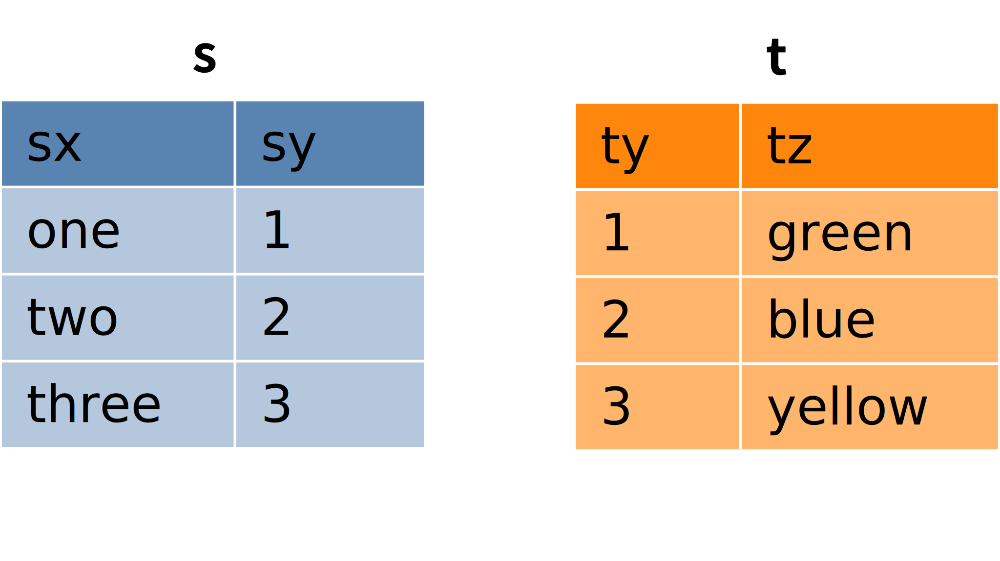
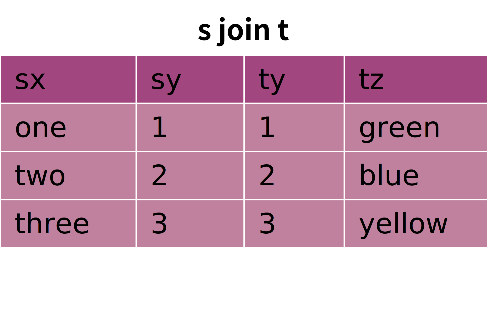
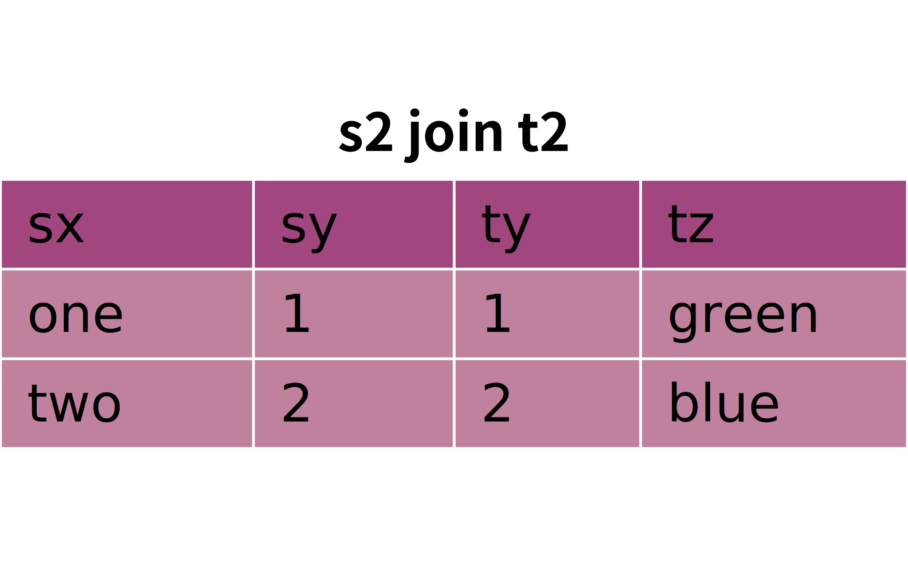
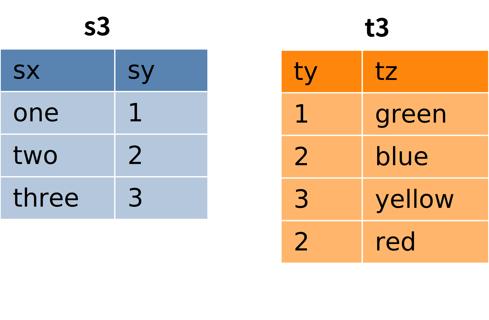
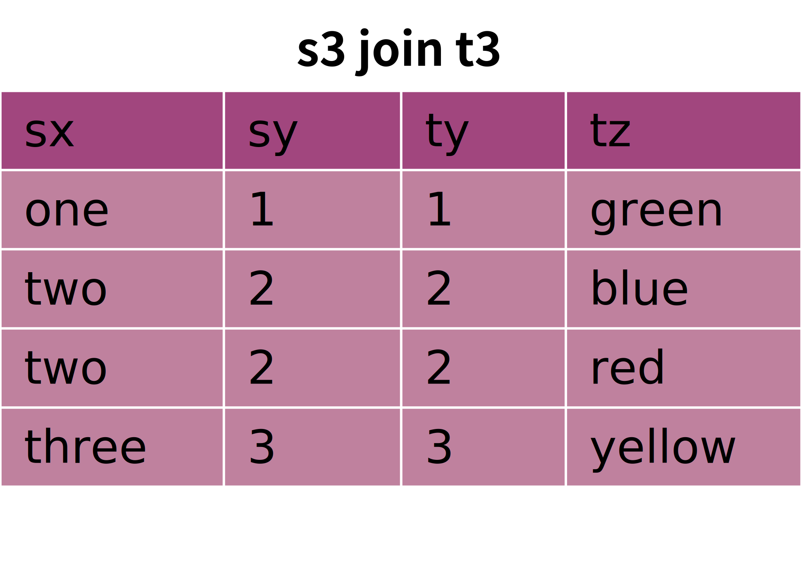

=====
Joins
=====

So far, we have seen how to retrieve data from individual tables, filtering data on different criteria, ordering the data, and formatting the data with various expressions.  Now we turn to the question of how to retrieve data from more than one table in a single query.  For example, using the example database from previous chapters, we might to see book titles together with author's name **and** birth and death dates. The author's name is in both the **authors** and **books** tables, but book titles are in **books**, while author birth and death dates are in **authors**.  How can we get these together in one result?  What we want to do is *join* the tables together.  In this chapter, you will learn all about joins!

Basics
::::::

To start with, we will consider an abstract example with a small amount of data.  Specifically, we will work with the two tables shown below, named **s** and **t**:

There is no real meaning to this data, but you might notice that the table data suggests a relationship.  Specifically, table **s** has a column **sy** containing small integers; table **t** has a column **ty** similarly containing small integers.  What we want to accomplish is to connect rows from table **s** with rows from table **t** according to the values in the **sy** and **ty** columns.  The desired result looks like this:

What we are going to do is tell the database that we want to pair up *all* the rows from both tables, and then specify which of the combined rows we want to keep.  Telling the database to pair up all the rows is accomplished simply by doing a **SELECT** query where both tables are listed in the **FROM** clause.  You can see this in action in the interactive tool below:

.. activecode:: ch4_example_cross_product
    :language: sql
    :dburl: /_static/joins.sqlite3

    Note that this tool accesses a database containing just the abstract tables described in this section.  It does not contain any tables related to authors and books!
    ~~~~
    SELECT * FROM s, t;

This is not what we were trying to accomplish, yet.  What we have created here is called a *cross product* of **s** and **t**.  To get a *join*, we need to add a *join condition* which tells SQL which rows are important.  To do this, we add a **WHERE** clause condition equating the columns **sy** and **ty**:

::

    SELECT * FROM s, t
    WHERE sy = ty;

Add this **WHERE** clause to the query in the interactive tool above to confirm that it gives the desired result.

In the example so far, we had the case of each row in **s** matching exactly one row in **t**, and each row in **t** matching exactly one row in **s**.  What happens if this is not the case?  First, consider tables **s2** and **t2** below, in which a row in each table fails to match any rows in the other table:

Joining **s2** and **t2** on columns **sy** and **ty** now gives us:

This result can be understood by considering the cross product of **s2** and **t2**, filtered by the **WHERE** clause ``WHERE sy = ty``.  Every row is paired by the cross product, but we keep only the combined rows where **sy** equals **ty**.  Since any rows where **sy** is 4 have no matching **ty** entry, those rows all get filtered out.  Similarly any rows where **ty** is 3 are filtered out.  (Tables **s2** and **t2** are also accessible from the interactive tool above, so you can try the cross product and join for yourself.)

We can also have the case where more than one row matches some row.  This can also be understood by thinking about taking the cross product and applying the join condition to filter the result.  Here are two more tables to consider:

If we take the cross product here, it is clear that we will have two combined rows where **sy** and **ty** both equal 2.  We will keep both, since both meet the join condition requirement, giving us this result:

Tables **s3** and **t3** are also in the database accessible in the interactive tool above.

Finally, note that our join condition is simply expressed as a **WHERE** clause condition.  You are free to add additional conditions to the **WHERE** clause to further refine the result.  For example,

::

    SELECT * FROM s, t
    WHERE sy = ty
    AND tz = 'blue';

We have a lot more to talk about with joins, but before moving on, let's see how to answer the question raised earlier, of seeing both book titles and author dates in one query result using the database from the previous chapters.  Here's an interactive tool on that database (we will be changing to a new database in a couple of sections).

.. activecode:: ch4_example_simple_books_join
    :language: sql
    :dburl: /_static/simple_books.sqlite3

    This tool accesses the database used in chapters 2 and 3.
    ~~~~
    SELECT title, author, birth, death
    FROM books, authors
    WHERE author = name;

Note here that we are choosing specific columns to return as part of our result.  The column **name**, used in the join condition, is the column containing author names in the **authors** table.  We compare this column to the **author** column in **books** for our join, but we don't include it in the columns we retrieve; otherwise we would have the same author name showing in two different columns.

Names of things
:::::::::::::::

We have (mostly) not worried much about the *names* of things in our discussion so far.  We have said that we can use a column name as an expression representing the value in the column for some row under consideration, but we now need to consider some scenarios in which a column's name by itself is not sufficiently specific.  We have also given some examples where we renamed the output columns for a **SELECT** query, but we deferred discussion of that technique.  This section will go into both of these topics and more.

Name collisions and ambiguity
-----------------------------

In all of our examples so far, all of the columns in the tables we queried had unique names.  For example, the cross product of **s** and **t** contained columns named **sx**, **sy**, **ty**, and **tz**.  However, we will often not be so lucky when working with multiple tables (a single table cannot contain duplicate column names).  When two columns have the same name, we say that the column names *collide*.  When a naming collision occurs, we cannot use that name as an expression in any part of our query, because the database will not know which column you mean; the database will give an error message that the column name is *ambiguous*.

Qualified names
---------------

Fortunately, there is an easy way to specify a particular column in a particular table: simply give the table name first, followed by a dot ("."), and then the column name.  You can do this even if names are not ambiguous. For example the last query above could be expressed as

::

    SELECT books.title, books.author, authors.birth, authors.death
    FROM books, authors
    WHERE books.author = authors.name;

This has the added benefit of making clear where each column is coming from, for anyone reading the query who is not familiar with the database.

You can also use the asterisk shortcut to mean all columns in a specific table by prefixing with the table name and dot:

::

    SELECT books.*, authors.birth, authors.death
    FROM books, authors
    WHERE books.author = authors.name;

These *qualified* column names can be used in any database.  In some databases, tables can be grouped together into larger containers; in those databases, it is possible to have multiple tables of the same name, which now must be qualified using the container name.  Each database is different, so you will need to learn about your particular database system's rules for qualifying names.

Aliasing
--------

SQL provides facilities to change the names of tables and columns within the context of a single query.  This can be useful, and at times, necessary.  We already used column renaming to get nicer column headers in our output.  For example, in the query

::

    SELECT title, floor((publication_year + 99) / 100) AS century FROM books;

we supplied the name "century" for the output column (which otherwise would have a header that looked like the mathematical expression we computed).  This technique is known as *aliasing*, and is accomplished with the **AS** keyword.  Aliasing for columns is most often used for the purpose of giving a helpful name for the column in the output, although it can be applied for other reasons we shall see.

Aliasing can also be used with tables.  This is often used to shorten table names to keep qualified names short and readable.  Here, the **AS** keyword is used in the **FROM** clause after each table that should be renamed.  The alias can then be used in the **SELECT**, **WHERE**, and other clauses in place of the table name.  Here is a query we did above, rewritten using table aliasing:

::

    SELECT b.title, b.author, a.birth, a.death
    FROM books AS b, authors AS a
    WHERE b.author = a.name;

While this may not seem like an improvement, when working with large queries using many tables, aliasing can make the query significantly smaller, and more readable.

One instance where table aliasing is not optional but necessary is when joining a table to itself.  This happens when there is some kind of relationship between rows within the same table, and happens more often than you might guess.  As an example of a query we might do with our books and authors database, consider the question, "what books were published in the same year as *The Three-Body Problem*?".  Here is one way to answer that question with a query:

::

    SELECT b2.*
    FROM books AS b1, books AS b2
    WHERE
      b1.publication_year = b2.publication_year   -- join condition
      AND b1.title = 'The Three-Body Problem';

If this seems confusing, think about it as using two tables, **b1** and **b2**, each containing the same data as **books**.  Then work through what happens if you take the cross product of **b1** and **b2** and apply the join condition ``b1.publication_year = b2.publication_year``; finally, filter that result with the condition ``b1.title = 'The Three-Body Problem'``.

When aliasing a table name, some database implementations require you to use the alias everywhere in the query when qualifying a column name; others allow you to use the original table name instead of the alias, although this is not very good practice.

Just remember, aliasing only affects the query in which the renaming occurs; a new query will know nothing about any previous aliasing applied to tables or columns.

Strings vs names
----------------

.. activecode:: ch4_example_books
    :language: sql
    :dburl: /_static/books.sqlite3
