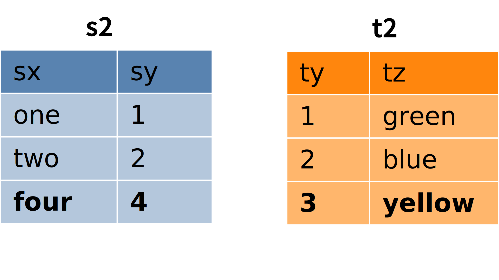
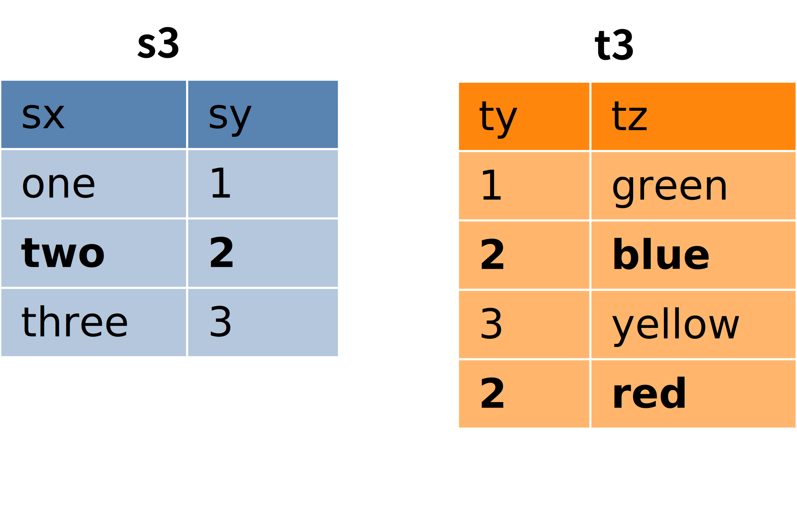
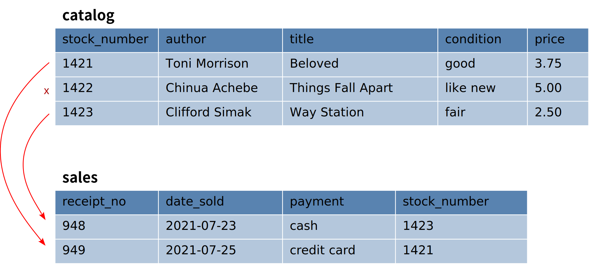

.. _joins-chapter:

==========================
Queries on multiple tables
==========================

.. _`Part 2`: ../../PART2_DATA_MODELING/index.html
.. _`Chapter 5`: ../05-table-creation/table-creation.html
.. _`Chapter 8`: ../08-grouping-and-aggregation/grouping-and-aggregation.html
.. _`Appendix A`: ../../appendix-a-datasets/datasets.html

So far, we have seen how to retrieve data from individual tables, filtering data on different criteria, ordering the data, and formatting the data with various expressions.  Now we turn to the question of how to retrieve data from more than one table in a single query.  For example, using the example database from previous chapters, we might to see book titles together with author's name **and** birth date. The author's name is in both the **authors** and **books** tables, but book titles are in **books**, while author birth dates are in **authors**.  How can we get these together in one result?  This chapter will explain how to retrieve data from multiple tables using *joins*, along the way introducing an expanded books database that will be used going forward.

Simple joins
::::::::::::

To start with, we will consider an abstract example with a small amount of data.  Specifically, we will work with the two tables shown below, named **s** and **t**:

.. image:: joins1.svg
    :alt: Tables s and t

There is no real meaning to this data, but you might notice that the table data suggests a relationship.  Specifically, table **s** has a column **sy** containing small integers; table **t** has a column **ty** similarly containing small integers.  What we want to accomplish is to connect rows from table **s** with rows from table **t** when the values in the **sy** and **ty** columns are the same.  The desired result looks like this:

.. image:: joins1_result.svg
    :alt: The desired result of connecting s and t

When rows from one table are paired with rows from another table, we call the result a *join* of the tables.  Here is a query that joins **s** and **t** to produce the result shown above:

.. activecode:: ch4_example_simple_join
    :language: sql
    :dburl: /_static/joins.sqlite3

    Note that this interactive tool accesses a database containing just the abstract tables described in this section.  It does not contain any tables related to authors and books!
    ~~~~
    SELECT *
    FROM
      s
      JOIN t ON sy = ty
    ;

As you can see, we start with some table (table **s** in the example above), then use the **JOIN** keyword to add a second table (table **t**), and the **ON** keyword to add a Boolean condition explaining to SQL which rows from the first table go with which rows from the second table.  The Boolean condition after **ON** is known as a *join condition*, because it compares a column from one table with a column from another table.

To understand what happens when you run this query, think about examining each row in **s** in turn.  For each row in **s**, examine each row in **t**.  If the join condition comparing the row in **s** with the row in **t** evaluates to ``True``, then make a new row pairing up the row from **s** with the row from **t**, and add it to the result.  (This can be compared to performing nested **for** loops in a programming language like Python or Java; the outer loop is over the rows in **s**, and the inner loop is over the rows in **t**.)

So, for example, we start by looking at the first row in **s**, which we can write as ``('one', 1)``.  The value of **sy** in this row is 1.  Now, we look at each row in **t** to see which ones have **ty** also equal to 1.  The first row in **t** is ``(1, 'green')``, which has a **ty** value of 1, so we make the row ``('one', 1, 1, 'green')`` and add it to the output.  No other rows in **t** match, so we move on to the next row in **s**, ``('two', 2)``.  Again, we consider each row in **t**, this time looking for a **ty** value equal to 2; this time we match the row ``(2, 'blue')``.  This process continues until we have processed every row in **s**.

In the first example, each row in **s** matched exactly one row in **t**, and each row in **t** matched exactly one row in **s**.  What happens if this is not the case?  First, consider tables **s2** and **t2** below, in which a row in each table fails to match any rows in the other table:

Joining **s2** and **t2** using the same equality condition on columns **sy** and **ty** now gives us:

.. image:: joins2_result.svg
    :alt: The join of s2 and t2

This result can again be understood by examining each row of **s2** and looking for matches in **t2**.  If there is no match, no row gets output.

We can also have the case where more than one row in one table matches some row in the other table.  Here are two more tables to consider:

This time, the **s3** row ``('two', 2)`` matches *two* different rows in **t3**, so we will produce two combined rows where **sy** and **ty** both equal 2:

.. image:: joins3_result.svg
    :alt: The join of s3 and t3

Tables **s3** and **t3** are also in the database accessible in the interactive tool above.

Two tables can be related via multiple columns rather than just one in each table.  To join them, you would use a compound join condition using **AND**.  In fact, join conditions do not have to be equality (although they usually are); any logical expression relating rows in one table with rows in another can be used.  The conceptual model of examining each row in the first table and comparing with each row in the second table still works.  See if you can figure out what this query will produce (then try it in the interactive tool above):do

::

    SELECT *
    FROM
      s
      JOIN t ON sy = ty OR sy > ty
    ;

**JOIN** clauses are considered to be sub-clauses of the **FROM** clause.  We are, of course, free to add other clauses as normal to the query, such as a **WHERE** clause:

::

    SELECT *
    FROM
      s
      JOIN t ON sy = ty
    WHERE tz = 'blue';

Think of the **FROM** clause as being the first part of the query processed by the database.  The result is some collection of rows, dowhich we can then filter with a **WHERE** clause, or put in a particular order with an **ORDER BY** clause, and so forth.

We have a lot more to talk about with joins, but before moving on, let's see how to answer the question raised earlier, of seeing both book titles and author birth dates in one query result using the database from the previous chapters.  Here's an interactive tool on that database (we will be changing to a new database later in this chapter).

.. activecode:: ch4_example_simple_books_join
    :language: sql
    :dburl: /_static/simple_books.sqlite3

    This interactive tool accesses the database used in chapters 2 and 3.
    ~~~~
    SELECT title, author, birth
    FROM
      books
      JOIN authors ON author = name
    ;

Note here that we are choosing specific columns to return as part of our result, using our **SELECT** clause.  The column **name**, used in the join condition, is the column containing author names in the **authors** table.  We compare this column to the **author** column in **books** for our join, but we don't include it in the columns we retrieve; otherwise we would have the same author name showing in two different columns.

Names of things
:::::::::::::::

We have (mostly) not worried about the *names* of things in our discussion so far.  We have said that we can use a column name as an expression representing the value in the column for some row under consideration, but we now need to consider some scenarios in which a column's name by itself is not sufficiently specific.  We have also given some examples where we renamed the output columns for a **SELECT** query, but we deferred discussion of that technique.  This section will go into both of these topics and more.

Name collisions and ambiguity
-----------------------------

In all of our examples so far, all of the columns in the tables we queried had unique names.  For example, the join of **s** and **t** contained columns named **sx**, **sy**, **ty**, and **tz**.  However, we will often not be so lucky when working with multiple tables.  When two columns from tables involved in a join have the same name, we say that the column names *collide*.  When a naming collision occurs, we cannot use the column name by itself as an expression in any part of our query, because the database will not know which table's column you mean; the database will give an error message that the column name is *ambiguous*.

Qualified names
---------------

Fortunately, there is an easy way to specify a particular column in a particular table: simply give the table name first, followed by a dot ("."), and then the column name.  You can do this even if names are not ambiguous. For example the last query above could be expressed as

::

    SELECT books.title, books.author, authors.birth
    FROM
      books
      JOIN authors ON books.author = authors.name
    ;

This has the added benefit of making clear where each column is coming from, for anyone reading the query who is not familiar with the database.

You can also use the asterisk shortcut to mean all columns in a specific table by prefixing with the table name and dot:

::

    SELECT books.*, authors.birth
    FROM
      books
      JOIN authors ON books.author = authors.name
    ;

The expressions using both the table name and the column name are known as *qualified* column names, and can be used with any database.  In some database implementations, tables can be grouped together into larger containers; in those databases, it is possible to have multiple tables of the same name (in different containers), which now must be qualified using the container name.  Each database implementation is different, so you will need to learn about your particular database system's rules for qualifying names.

When doing a join, it is good practice to qualify all of your column names as we did in the queries above.  This will make it easier for anyone reading or maintaining your code to understand what your query is doing.

Aliasing
--------

SQL provides facilities to change the names of tables and columns within the context of a single query.  This can be useful, and at times, necessary.  We already used column renaming to get nicer column headers in our output.  For example, in the query

::

    SELECT title, floor((publication_year + 99) / 100) AS century FROM books;

we supplied the name "century" for the output column (which otherwise would have a header that looked like the mathematical expression we computed).  This technique is known as *aliasing*, and is accomplished with the **AS** keyword.  Aliasing for columns is most often used for the purpose of giving a helpful name for the column in the output, although it can be applied for other reasons we shall see.

Aliasing can also be used with tables.  This is often used to shorten table names to keep qualified names short and readable.  Here, the **AS** keyword is used in the **FROM** clause after each table that should be renamed.  The alias can then be used in the **SELECT**, **WHERE**, and other clauses in place of the table name.  Here is a query we did above, rewritten using table aliasing:

::

    SELECT b.title, b.author, a.birth
    FROM
      books AS b
      JOIN authors AS a ON b.author = a.name
    ;

When working with large queries using many tables, aliasing can make the query significantly smaller and more readable.

One instance where table aliasing is required is when joining a table to itself.  This can be done when there is some kind of relationship between rows within the same table, and happens more often than you might guess.  As an example of a query we might do with our books and authors database, consider the question, "what books were published in the same year as *The Three-Body Problem*?".  Here is one way to answer that question with a query:

::

    SELECT b2.*
    FROM
      books AS b1
      JOIN books AS b2
        ON b1.publication_year = b2.publication_year
    WHERE
      b1.title = 'The Three-Body Problem';

If this seems confusing, think about it as using two tables, **b1** and **b2**, each containing the same data as **books**.  Work through what happens if you join **b1** and **b2** applying the join condition ``b1.publication_year = b2.publication_year``; then, filter that result with the condition ``b1.title = 'The Three-Body Problem'``; finally, output just the columns from **b2**.  If you have trouble visualizing what the result should be at each step, remember you can query the database using the interactive tool above.

When using table aliasing, you should qualify all of your column names using the aliases as a matter of good style.  Some databases allow you to use original table names instead of aliases, but mixing aliases with original table names is inconsistent and confusing, and in some cases can result in incorrect code that is difficult to debug.

Just remember, aliasing only affects the query in which the renaming occurs; a new query will know nothing about any previous aliasing applied to tables or columns.

As a final note, the **AS** keyword is actually optional in SQL - you can create an alias with this keyword omitted.  Simply put a valid identifier string after the name of a table or after a column expression:

::

  SELECT b.title, b.author, a.birth
  FROM
    books b
    JOIN authors a ON b.author = a.name
  ;

Leaving out a keyword may seem strange, but you are likely to read code at some point using this form of aliasing, so be aware.  There is no consensus on which style is better; for this textbook, we will consistently use **AS** for additional clarity.  Note for Oracle users: the **AS** keyword is optional for columns, but is not supported for table aliases - you must omit the **AS** in Oracle queries when aliasing a table.

Names with spaces or mixed-case
-------------------------------

Usually, names of things are case-insensitive and do not contain spaces.  Also, the case used when displaying the output headers for a query may be all uppercase or all lowercase, depending on the database (for this textbook, lowercase is the norm).  It is possible, however, to use names which are case-sensitive and which contain spaces.  To do this, put the name within double quotes.  For example, in the query:

::

    SELECT 42 AS "The Answer";

the header in the output column will be both mixed-case and contain spaces.

Very rarely, you may encounter a database where table or column names are mixed-case or contain spaces.  This can occur when the database creator used double quotes in the SQL code creating the tables.  In general, this is not a good practice, as it forces the use of double quotes for any queries using the table.

Identity columns
::::::::::::::::

If we want to make a connection between data in one table and data in another using a join, we need the tables to share some data elements in common.  In our original books database, the common element was the author's name, which was in both the **books** and **authors** tables; this let us join the two tables with the join condition ``books.author = authors.name``.

For some types of data, some element of the data is unique for every possible data item and can be used as an identifier for the data in a database.  For example, international travel to many countries requires the traveler to have a passport; the issuing country together with the passport number uniquely identifies any traveler.  However, this only works for international travel; most countries do not require passports for travel within the country's own borders, and therefore there are many people who have no passport at all.  A database trying to track domestic travelers, then, cannot use passport information as a unique identifier.

Author names might seem like a good identifier for authors, but in fact, we have to be careful here as well, due to multiple authors sharing the same name.  For example, there are two novelists named Richard Wright, and both a novelist and a poet named David Diop.  We could further distinguish between these authors using their birth dates, or if that wasn't enough, we could consider their birthplace or other attributes.  That only works, of course, if we *know* the birth date and so forth of each author in our database, and in any case it begins to be an unsatisfactory solution due to the complexity of having to store multiple pieces of information about each author for any tables that relate to our **authors** table.

The solution we adopt, and which is widely used in practice, is to create an artificial unique identifier, or *id*, for each author in our database.  Unique identifiers can take different forms.  The most common scheme is to keep a counter in the database (using a special database object called a *sequence* - we will discuss these in `Chapter 5`_), and increment it each time a row is added to a table; the counter value is used as the id value for the new row.  Another popular scheme is to use a very large integer generated at random - a *universally unique identifier*, or UUID.  In this scheme, due to the large number of possible UUIDs, each new id value is very likely to be different from any other previously id in the table. (It is easy to detect if there is a duplicate, in which case another value can be generated.)

In the expanded books database that we will use from now on, the **authors** table has an **id** column.  Each row in the **authors** table has a unique **id** value.  The **books** table, meanwhile, no longer has a column storing the author's name.  Instead, it has the column **author_id**.  Each **author_id** is equal to some **id** value from the **authors** table.  Thus, to join the two tables we simply use the join condition ``authors.id = books.author_id``:

.. activecode:: ch4_example_expanded_books_join
    :language: sql
    :dburl: /_static/books.sqlite3

    This interactive tool accesses the new, expanded books database.
    ~~~~
    SELECT books.title, authors.name, authors.birth
    FROM
      books
      JOIN authors ON authors.id = books.author_id
    ;

Note that, in the query above, we *must* qualify the column **id** as **authors.id**, because the books table also has a column named **id**.  If you try the above query without qualification, you will see that the database complains of ambiguity with respect to this name.

The expanded books database
:::::::::::::::::::::::::::

We are now ready to describe the database we will be using for the rest of this book.  The new database is still centered around **book** and **authors** tables, modified to use id columns as described above, but also adds several other tables.  All of the tables and their basic relationships to each other are described below, after which we will discuss some basic join queries using the tables.  The descriptions below are also repeated in `Appendix A`_ for future reference.

.. container:: data-dictionary

    Table **authors** records persons who have authored books:

    ========== ================= ===================================
    column     type              description
    ========== ================= ===================================
    id         integer           unique identifier for author
    name       character string  full name of author
    birth      date              birth date of author, if known
    death      date              death date of author, if known
    ========== ================= ===================================

.. container:: data-dictionary

    Table **books** records works of fiction, non-fiction, poetry, etc. by a single author:

    ================ ================= ===================================
    column           type              description
    ================ ================= ===================================
    id               integer           unique identifier for book
    author_id        integer           id of book's author from **authors** table
    title            character string  book title
    publication_year integer           year book was first published
    ================ ================= ===================================

.. container:: data-dictionary

    Table **editions** records specific publications of a book:

    ================== ================= ===================================
    column             type              description
    ================== ================= ===================================
    id                 integer           unique identifier for edition
    book_id            integer           id of book (from **books** table) published as edition
    publication_year   integer           year this edition was published
    publisher          character string  name of the publisher
    publisher_location character string  city or other location(s) where the publisher is located
    title              character string  title this edition was published under
    pages              integer           number of pages in this edition
    isbn10             character string  10-digit international standard book number
    isbn13             character string  13-digit international standard book number
    ================== ================= ===================================

.. container:: data-dictionary

    Table **awards** records various author and/or book awards:

    ================== ================= ===================================
    column             type              description
    ================== ================= ===================================
    id                 integer           unique identifier for award
    name               character string  name of award
    sponsor            character string  name of organization giving the award
    criteria           character string  what the award is given for
    ================== ================= ===================================

.. container:: data-dictionary

    Table **authors_awards** is a *cross-reference* table (explained below) relating **authors** and **awards**; each entry in the table records the giving of an award to an author (not for any particular book) in a particular year:

    ================== ================= ===================================
    column             type              description
    ================== ================= ===================================
    author_id          integer           id of the author receiving the award
    award_id           integer           id of the award received
    year               integer           year the award was given
    ================== ================= ===================================

.. container:: data-dictionary

    Table **books_awards** is a *cross-reference* table (explained below) relating **books** and **awards**; each entry in the table records the giving of an award to an author for a specific book in a particular year:

    ================== ================= ===================================
    column             type              description
    ================== ================= ===================================
    book_id            integer           id of the book for which the award was given
    award_id           integer           id of the award received
    year               integer           year the award was given
    ================== ================= ===================================

We strongly recommend that you spend a little time using **SELECT** queries on each table above, to get a sense of what the data looks like.  Here is an interactive tool to get you started:

.. activecode:: ch4_example_expanded_books_explore
    :language: sql
    :dburl: /_static/books.sqlite3

    SELECT * FROM authors;

Table relationships
:::::::::::::::::::

One of the strengths of relational databases compared to earlier database systems is that relationships are not explicitly stored in the database.  This provides a number of advantages regarding database design and software complexity, which are mostly beyond the scope of this book.  One important advantage of the relational approach is that you can easily express queries concerning relationships which were not anticipated by the designer of the database; for example, the query we did earlier looking for books published in the same year as another book.  However, this flexibility also means that, when you encounter a new relational database, you may not immediately understand the structure and relationships in the database, or how (or why) to join two tables together.

A well structured database usually gives some indication of likely places to join tables together.  One indication may be in the names of columns - e.g., **book_id** strongly suggests a column that links to the **id** column of the **books** table.  Another indication can come in the form of *foreign key constraints*, a topic we will explore in `Chapter 5`_.  Exploring the database to find these implicit relationships is an important first step in learning any new database.

Your database might also come with a data model diagram, which is something we will explore more in `Part 2`_.  The data model will typically make explicit the relationships between tables.  While data can be related to each other in very complex ways, there are some basic relationship types that capture the important aspects of most relationships.  These relationships are commonly called "one-to-one", "one-to-many", and "many-to-many".  Below, we discuss these common relationships and how they are used in our expanded books database.  In `Part 2`_ of the book, we will explore the discover and modeling of these relationships when creating a database.

One-to-one
----------

*One-to-one* describes a relationship between two types of data.  If we think of each data type as having its own table, then each row in one table has a well-defined relationship with *at most* one row in the other table, and vice versa.  Sometimes each row in a table has exactly one corresponding row in the other table, and vice versa; other times, some rows in one or both tables may have no corresponding rows in the other table.  When there is a true one-to-one correspondence between tables, it is sometimes desirable to combine the tables into one larger table (whether or not to do this is a design concern that we will consider more in `Part 2`_).

There are no obvious one-to-one relationships in our expanded books database.  An example of a one-to-one relationship, sticking with our books theme, might appear in a database for a seller of used books.  In this database, each of the seller's books is recorded in a table named **catalog**.  Each row in **catalog** will record things such as the book's author and title, condition, and current price.  This imagined database also contains a table named **sales**, which records information when a book is sold, such as the date sold, payment type, and a receipt number.  The two tables can be joined by the common column **stock_number**, which is unique for each book in the **catalog**.  Note that every record in the **sales** table corresponds to exactly one record in the **catalog** table; however, any unsold books still in the seller's possession will not have a corresponding **sales** record.

    Some example rows from the **catalog** and **sales** tables; two rows in **catalog** have **sales** records, but the third has not been sold yet.

One-to-many
-----------

*One-to-many* refers to the case when rows in one table correspond to some number of rows in another table, but rows in the second table correspond to at most one row in the other table.  In some cases, rows in the first table always have at least one corresponding row; other times, rows can have zero or more corresponding rows.

In our earlier books database, we had exactly one **books** record for each **authors** record.  This is not reflective of the real world, in which authors may have written many books.  In the expanded database we will start using shortly, we assume a one-to-many relationship between authors and books - each author has one or more books, but each book has exactly one author.  (This is not reflective of the real world, either - many books exist that were written by two or more authors working together!  However, for simplicity our database only contains single-author books.)  Note that we can also talk of *many-to-one* relationships, which are just the symmetric equivalent of one-to-many; we can say that **authors** is in a one-to-many relationship with **books**, or that **books** is in a many-to-one relationship with **authors**.

To connect rows from one table to rows in another table where a one-to-many relationship exists between the tables, the simplest approach is to ensure that the table on the "one" side of the relationship has a unique id column of some sort; the table on the "many" side can then have a column that uses the id values from the "one" side table.  As we saw above, this strategy is used with **books** and **authors**; the **authors** table has an **id** column, which is unique for every row, and the **books** table has the corresponding column **author_id**.

Similarly, in our expanded database the **books** table has a one-to-many relationship with the **editions** table.  In this case, the **editions** table has a **book_id** column, which, as you might guess, contains values from the **id** column of **books**.

Note that, because the database would be rather large (for use in your web browser) if we included all the known editions of all of the books in our database, the **editions** table only contains editions for books by author J.R.R. Tolkien.  The editions data is particularly "dirty", in the sense that there are many missing pieces of information, and the accuracy and completeness of the data are questionable (you can read more about the data and how it was collected in `Appendix A`_).

Many-to-many
------------

*Many-to-many*, you can probably guess, implies that rows in one table may correspond to multiple rows in the other table, and vice versa.  In our expanded database, our examples of many-to-many relationships will involve book and author awards.  For example, the Hugo Award is given out each year to a book in the science fiction genre.  In our database, there are many books that have won a Hugo Award; therefore the row for the Hugo Award in the **awards** table relates to multiple rows in the **books** table.  Especially good science fiction books might win both a Hugo Award and a Nebula Award; so rows in the **books** table can correspond to multiple **awards** rows.

How do you connect rows from one table to rows in another table when there is a many-to-many relationship?  If you try the trick we used with one-to-many relationships, you quickly run into trouble.  For example, suppose we try to use the **id** column from **books** in the **awards** table; since many books have won the Hugo Award, we need to store many book ids, so we would have many rows for the Hugo Award, all identical except for the book id. On the other hand, if we try to store award ids in the **books** table, books that have won multiple awards will need multiple rows, all identical except for the award ids [#]_.  Having multiple nearly identical rows creates a number of problems, some of which we will explore in chapter XXX.

The solution is to use a third table, known as a *cross-reference* table, as a connector.  At minimum, a cross-reference table will have a column for each of the unique id columns in the two tables being connected.  For example, the **books_awards** table in our database has a column **book_id** referring to the **id** column of **books**, and an **award_id** column referring to the **id** column of **awards**.  The existence of a book id, award id pair in the **books_awards** table means that the corresponding book has won the corresponding award.

We can store other information in the cross-reference table.  In the case of **books_awards** we also have a **year** column, which stores the year in which the award was given to the book.  Note that the cross-reference table is really the only place we can store this information; the year doesn't properly "belong" to the award, as an award is given out in many years; and it doesn't properly belong to the book, as books can win awards in different years.

To use the cross-reference table, we will need to join together *three* tables.  The basic principles for joining three tables are the same as for two; start by joining two tables, then join that result with the third table.  The finished query looks like this:

.. activecode:: ch4_example_many_to_many
    :language: sql
    :dburl: /_static/books.sqlite3

    SELECT b.title, a.name AS award, ba.year
    FROM
      books AS b
      JOIN books_awards AS ba
        ON b.id = ba.book_id
      JOIN awards AS a
        ON a.id = ba.award_id
    ;

Looking at the query above, think of the first join as adding award ids from the cross-reference table to the rows from the books table; and think of the second join as then bringing in the award information matching the award ids.  (Again, you can break this query down into smaller pieces and try them in the interactive tool to help build your intuition about how SQL works.)

Inner and outer joins
:::::::::::::::::::::

When relational database programmers use the word "join" without any qualifiers, they almost always mean the type of join we have been describing above, in which the result only contains rows that match on both sides of the join.  This type of join is more formally known as an *inner join*.  In fact, you can optionally use the keyword **INNER** in front of **JOIN** if you want to make clear what type of join you are doing; however, **INNER** is commonly dropped simply because the default without **INNER** is still an inner join.

What if you want to retrieve *all* rows from one table in a join, even if there are no matching rows on the other side of the join?  For example, we might want a list of books, together with any awards the books have won.  Since not all books have won awards, the inner join of the **books**, **books_awards**, and **awards** shown above only returns some of the books in our database.  To get all books, and awards where present, we want an *outer join*.

There are three types of outer join: *left*, *right*, and *full*.  These are implemented with the key phrases **LEFT [OUTER] JOIN**, **RIGHT [OUTER] JOIN**, and **FULL [OUTER] JOIN**.  (The square brackets mean that the **OUTER** keyword is optional; that is, **LEFT JOIN** means the same thing as **LEFT OUTER JOIN**.)  In an outer join, all rows from one or both tables are returned, depending on the type of outer join.  In a left outer join, all of the rows from the table on the left-hand side of the **LEFT JOIN** key phrase are returned, but only matching rows are returned from the right-hand side table.  **RIGHT JOIN** does the opposite, while **FULL JOIN** returns all rows from both tables involved in the join.

When the join specifies that all rows from a table should be returned, and a row has no match in the other table, what should the row contain for the missing data from the other table?  A logical choice is to fill in those columns with ``NULL`` values, which is exactly what happens.  Here is one query to retrieve all books, and awards where relevant:

.. activecode:: ch4_example_outer_join
    :language: sql
    :dburl: /_static/books.sqlite3

    SELECT b.title, a.name AS award, ba.year
    FROM
      books AS b
      LEFT JOIN books_awards AS ba
        ON b.id = ba.book_id
      LEFT JOIN awards AS a
        ON a.id = ba.award_id
    ;

Note that we have to do two outer joins in the above query.  The first outer join between **books** and **books_awards** is necessary because books without awards will have no matching records in the **books_awards** cross reference table.  The result of that join, then, will have ``NULL`` values for the **award_id** column coming from the **books_awards** table.  So, when we join with **awards** we again need an outer join, because the ``NULL`` **award_id** values will not match any rows in the **awards** table.

In most databases, we could instead write the query using one right outer join (at the time this book was written, SQLite did not yet support right or full outer joins, so this query may not work in the interactive tool above):

::

    SELECT b.title, a.name AS award, ba.year
    FROM
      awards AS a
      JOIN books_awards AS ba
        ON a.id = ba.award_id
      RIGHT JOIN books AS b
        ON b.id = ba.book_id
    ;

Here, the **awards** and **books_awards** tables can use a regular join, as we only care about awards that are referenced in the **books_awards** table, and all rows in the **books_awards** table have a matching entry already in the **awards** table.  However, a right outer join would have worked equally well - an outer join is equivalent to an inner join if all rows match!

The above queries do exhibit one behavior which may be unwanted, which is that we have multiple rows for books that have won multiple awards.  Some databases provide a way to produce a list of awards after each book, rather than multiple rows; however, that will have to wait until we explore grouping and aggregation in `Chapter 8`_.

Implicit join syntax
::::::::::::::::::::

The ability to do (inner) joins existed in SQL long before the **JOIN** keyword and related key phrases.  Prior to the introduction of this *explicit* join syntax, joins used an *implicit* join syntax, which is described in this section.  You may prefer the explicit syntax above, and it is considered by many practitioners to be best practice to use it for the clarity it provides.  However, the implicit syntax is supported by all databases and you are very likely to encounter in in practice; additionally, most databases reduce the explicit syntax to the implicit syntax internally, which has implications for understanding how the database processes join queries.  For these reasons, it is important that you understand the implicit join syntax.

Returning to our abstract examples from the start of this chapter:

.. image:: joins1.svg
    :alt: Tables s and t

In the implicit join syntax, the first step is to simply list all tables involved in the join after the **FROM** clause.  In SQL, this implies a *cross product* of the tables.  In a cross product of two tables, *every* row in one table is paired with *every* row from the other table.  You can see this in action in the query below:

.. activecode:: ch4_example_implicit_join
    :language: sql
    :dburl: /_static/joins.sqlite3

    SELECT * FROM s, t;

Given this result, how do we apply join conditions to get the rows we actually want?  We simply put our join conditions into the **WHERE** clause:

::

    SELECT * FROM s, t
    WHERE sy = ty;

This is equivalent in all respects to:

::

    SELECT *
    FROM
      s
      JOIN t ON sy = ty
    ;

That is, all conditions that would normally be put after the **ON** keyword in a **JOIN** clause should be put into the **WHERE** clause when using the implicit join syntax.  If you consider the cross product of **s** and **t**, it is easy to see how applying the join condition to filter the cross product produces the desired result [#]_.

One danger in using the implicit join syntax is that it separates join conditions from the part of the query that actually joins table, making it easy to accidentally leave out a join condition.  The join conditions instead are put into the **WHERE** clause together with any other single-table conditions needed.

If you are joining together *n* tables using the implicit syntax, then always remember that you need *n - 1* join conditions to ensure that all of the tables are linked in.  It is important that all of the tables connect to each other either directly or through a path of other tables (if you are familiar with data structures, the tables must be the nodes of a *connected graph*, generally in the shape of a *free tree*, with the edges represented by join conditions).  Remember that *n - 1* join conditions may mean more than *n - 1* **WHERE** clause conditions, if any of the join conditions are compound.  If you add a join condition to your **WHERE** clause for each new table you add to the **FROM** clause as you are writing your query, you can systematically create the proper join structure.

A good clue that you have omitted a join condition is if you suddenly get very many rows more than you expected.  If you look more closely at the data (you may need to include more columns in your **SELECT** clause to see it), you can see that you have created a cross product.  Consider an implicit join of **books**, **books_awards**, and **awards** with a missing join condition:

.. activecode:: ch4_example_missing_join_condition
    :language: sql
    :dburl: /_static/books.sqlite3

    SELECT b.title, a.name AS award, ba.year
    FROM books AS b, awards AS a, books_awards AS ba
    WHERE b.id = ba.book_id
    -- missing: AND a.id = ba.award_id
    ;

It looks like every book that has won an award has won *every* award!  That is due to the cross product resulting from the missing join condition.

Implicit join syntax is standard only for inner joins.  Some database implementations do provide non-standard ways of doing outer joins using the implicit form, and you may see older queries using these.  Since notations vary, we will not include any examples here.

As a final note, cross products are seldom a desired result on their own.  However, if you actually need a cross product and wish to be explicit about it, SQL provides the **CROSS JOIN** key phrase for your use:

::

    SELECT * FROM s CROSS JOIN t;

Self-check exercises
::::::::::::::::::::

This section contains some exercises using the expanded books database introduced above.  If you get stuck, click on the "Show answer" button below the exercise to see a correct answer.  For each of these, try writing the answer first using explicit join syntax, and then using the implicit syntax (where possible).

.. activecode:: ch4_self_test_two_way_join
    :language: sql
    :dburl: /_static/books.sqlite3

    Write a query listing all of the editions (publisher, year, and published title) for the book titled "The Hobbit":
    ~~~~

.. reveal:: ch4_self_test_two_way_join_hint
    :showtitle: Show answer
    :hidetitle: Hide answer

    Explicit:

    ::

        SELECT e.publisher, e.publication_year, e.title
        FROM
          books AS b
          JOIN editions AS e ON b.id = e.book_id
        WHERE b.title = 'The Hobbit';

    Implicit:

    ::

        SELECT e.publisher, e.publication_year, e.title
        FROM books AS b, editions AS e
        WHERE b.id = e.book_id
        AND   b.title = 'The Hobbit';

.. activecode:: ch4_self_test_two_way_join2
    :language: sql
    :dburl: /_static/books.sqlite3

    Write a query listing the distinct titles under which the book 'The Fellowship of the Ring' was published:
    ~~~~

.. reveal:: ch4_self_test_two_way_join2_hint
    :showtitle: Show answer
    :hidetitle: Hide answer

    ::

        SELECT DISTINCT e.title
        FROM
          books AS b
          JOIN editions AS e ON b.id = e.book_id
        WHERE b.title = 'The Fellowship of the Ring';

        SELECT DISTINCT e.title
        FROM books AS b, editions AS e
        WHERE b.id = e.books_id
        AND   b.title = 'The Fellowship of the Ring';

.. activecode:: ch4_self_test_two_way_join3
    :language: sql
    :dburl: /_static/books.sqlite3

    Write a query listing editions (title, corresponding book title, publisher, and publisher location) for editions published since 2005 under a different name than the book:
    ~~~~

.. reveal:: ch4_self_test_two_way_join3_hint
    :showtitle: Show answer
    :hidetitle: Hide answer

    ::

        SELECT e.title, b.title, e.publisher, e.publisher_location
        FROM
          books AS b
          JOIN editions AS e
            ON b.id = e.book_id AND b.title <> e.title
        WHERE e.publication_year > 2005;

        SELECT e.title, b.title, e.publisher, e.publisher_location
        FROM books AS b, editions AS e
        WHERE b.id = e.book_id
        AND   b.title <> e.title
        AND   e.publication_year > 2005;

.. activecode:: ch4_self_test_three_way_join
    :language: sql
    :dburl: /_static/books.sqlite3

    Write a query listing author, book title, edition title, and publisher for editions published since 2005:
    ~~~~

.. reveal:: ch4_self_test_three_way_join_hint
    :showtitle: Show answer
    :hidetitle: Hide answer

    ::

        SELECT a.name, b.title, e.title, e.publisher
        FROM
          authors AS a
          JOIN books AS b ON a.id = b.author_id
          JOIN editions AS e ON b.id = e.book_id
        WHERE e.publication_year > 2005;

        SELECT a.name, b.title, e.title, e.publisher
        FROM authors AS a, books AS b, editions AS e
        WHERE a.id = b.author_id
        AND   b.id = e.book_id
        AND   e.publication_year > 2005;

.. activecode:: ch4_self_test_cross_reference1
    :language: sql
    :dburl: /_static/books.sqlite3

    Write a query to list the authors who have won the Neustadt International Prize for Literature (note: this is an *author* award, not a *book* award):
    ~~~~

.. reveal:: ch4_self_test_cross_reference1_hint
    :showtitle: Show answer
    :hidetitle: Hide answer

    ::

        SELECT au.name
        FROM
          authors AS au
          JOIN authors_awards AS aa ON aa.author_id = au.id
          JOIN awards AS aw ON aa.award_id = aw.id
        WHERE aw.name = 'Neustadt International Prize for Literature';

        SELECT au.name
        FROM authors AS au, authors_awards AS aa, awards AS aw
        WHERE aa.author_id = au.id
        AND   aa.award_id = aw.id
        AND   aw.name = 'Neustadt International Prize for Literature';

.. activecode:: ch4_self_test_cross_reference2
    :language: sql
    :dburl: /_static/books.sqlite3

    Write a query to list the authors who have won author awards (not book awards), together with their awards and the year of the award. Give the output descriptive headers (not just "name" and "name").  Order by author name:
    ~~~~

.. reveal:: ch4_self_test_cross_reference2_hint
    :showtitle: Show answer
    :hidetitle: Hide answer

    ::

        SELECT au.name AS author, aw.name AS award, aa.year
        FROM
          authors AS au
          JOIN authors_awards AS aa ON aa.author_id = au.id
          JOIN awards AS aw ON aa.award_id = aw.id
        ORDER BY au.name;

        SELECT au.name AS author, aw.name AS award, aa.year
        FROM authors AS au, authors_awards AS aa, awards AS aw
        WHERE aa.author_id = au.id
        AND   aa.award_id = aw.id
        ORDER BY au.name;

.. activecode:: ch4_self_test_outer_join1
    :language: sql
    :dburl: /_static/books.sqlite3

    Write a query listing all authors, together with their (author) awards, if any:
    ~~~~

.. reveal:: ch4_self_test_outer_join1_hint
    :showtitle: Show answer
    :hidetitle: Hide answer

    ::

      SELECT au.name AS author, aw.name AS award, aa.year
      FROM
        authors AS au
        LEFT JOIN authors_awards AS aa ON aa.author_id = au.id
        LEFT JOIN awards AS aw ON aa.award_id = aw.id
      ORDER BY au.name;

.. activecode:: ch4_self_test_outer_join2
    :language: sql
    :dburl: /_static/books.sqlite3

    Write a query listing authors who have *not* won any of the awards listed in our database (hint: how might you detect the absence of an award in the query above?):
    ~~~~

.. reveal:: ch4_self_test_outer_join2_hint
    :showtitle: Show answer
    :hidetitle: Hide answer

    ::

      SELECT au.name
      FROM
        authors AS au
        LEFT JOIN authors_awards AS aa ON aa.author_id = au.id
      WHERE aa.author_id IS NULL;

.. activecode:: ch4_self_test_recursive_join1
    :language: sql
    :dburl: /_static/books.sqlite3

    Write a query listing all the books by the author of "Interpreter of Maladies".
    ~~~~

.. reveal:: ch4_self_test_recursive_join1_hint
    :showtitle: Show answer
    :hidetitle: Hide answer

    ::

        SELECT b1.title
        FROM
          books AS b1
          JOIN books AS b2 ON b2.author_id = b1.author_id
        WHERE b2.title = 'Interpreter of Maladies';

        SELECT b1.title
        FROM books AS b1, books AS b2
        WHERE b1.author_id = b2.author_id
        AND   b2.title = 'Interpreter of Maladies';

.. activecode:: ch4_self_test_recursive_join2
    :language: sql
    :dburl: /_static/books.sqlite3

    Same as above, but show the author's name as well.
    ~~~~

.. reveal:: ch4_self_test_recursive_join2_hint
    :showtitle: Show answer
    :hidetitle: Hide answer

    ::

        SELECT b1.title, a.name
        FROM
          books AS b1
          JOIN authors AS a ON b1.author_id = a.id
          JOIN books AS b2 ON b2.author_id = a.id
        WHERE b2.title = 'Interpreter of Maladies';

        SELECT b1.title, a.name
        FROM books AS b1, books AS b2, authors AS a
        WHERE b1.author_id = a.id
        AND   b2.author_id = a.id
        AND   b2.title = 'Interpreter of Maladies';

.. activecode:: ch4_self_test_challenge1
    :language: sql
    :dburl: /_static/books.sqlite3

    Write a query to list books (author name and title) that have won the Nebula Award; show the year of the award, and list the most recent awards first.
    ~~~~

.. reveal:: ch4_self_test_recursive_challenge1_hint
    :showtitle: Show answer
    :hidetitle: Hide answer

    ::

        SELECT au.name AS author, b.title, ba.year
        FROM
          authors AS au
          JOIN books AS b ON au.id = b.author_id
          JOIN books_awards AS ba ON b.id = ba.book_id
          JOIN awards AS aw ON aw.id = ba.award_id
        WHERE aw.name = 'Nebula Award'
        ORDER BY ba.year DESC;

        SELECT au.name AS author, b.title, ba.year
        FROM authors AS au, books AS b, books_awards AS ba, awards AS aw
        WHERE au.id = b.author_id
        AND   b.id = ba.book_id
        AND   aw.id = ba.award_id
        AND   aw.name = 'Nebula Award'
        ORDER BY ba.year DESC;

.. activecode:: ch4_self_test_challenge2
    :language: sql
    :dburl: /_static/books.sqlite3

    Write a query giving a distinct list of book awards won by authors who have also won the Nobel Prize in Literature (an author award).
    ~~~~

.. reveal:: ch4_self_test_recursive_challenge2_hint
    :showtitle: Show answer
    :hidetitle: Hide answer

    ::

        SELECT DISTINCT aw1.name
        FROM
          books AS b
          JOIN books_awards AS ba ON b.id = ba.book_id
          JOIN awards AS aw1 ON aw1.id = ba.award_id  -- book awards
          JOIN authors_awards AS aa ON b.author_id = aa.author_id
          JOIN awards AS aw2 ON aw2.id = aa.award_id  -- author awards
        WHERE aw2.name = 'Nobel Prize in Literature';

        SELECT DISTINCT aw1.name
        FROM
          books AS b,
          books_awards AS ba,
          awards AS aw1,         -- book awards
          authors_awards AS aa,
          awards AS aw2          -- author awards
        WHERE b.id = ba.book_id
        AND   aw1.id = ba.award_id
        AND   b.author_id = aa.author_id
        AND   aw2.id = aa.award_id
        AND   aw2.name = 'Nobel Prize in Literature';

.. [#] You could argue that the **books** table should store an *array* of award ids, instead of just a single award id, thus solving the dilemma.  This is actually possible in a handful of database implementations that support array-valued columns.  However, the use of such columns is not without controversy.  For this textbook, we will take the more common approach of using cross-reference tables.

.. [#] Because a cross product has a number of rows equal to the number of rows in one table times the number of rows in the other table, the product is very large when the tables involved are large.  Even though databases typically convert explicit joins to their implicit equivalents internally, when database systems process joins, they generally do not create the cross product and then apply the **WHERE** clause conditions, as that would require a lot of memory or temporary storage and be very slow.  However, the conceptual model is helpful in understanding the end result.  We will discuss some strategies databases use to implement joins in part 4, chapter XXX.
