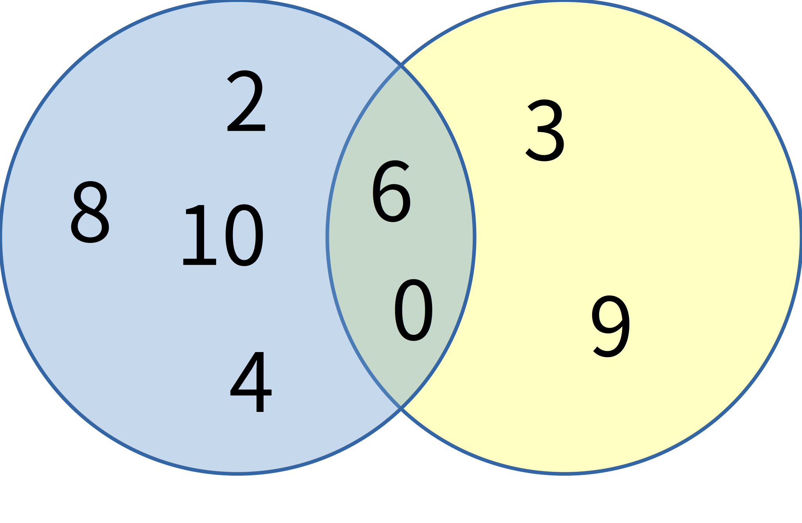

.. _sets-chapter:

==============
Set operations
==============

Relational database theory is based on mathematical set theory.  Even though relational database implementations stray from the theory in some important regards, the notion of sets remains important.  In this chapter, we examine the three set operations available to us in SQL.

Tables used in this chapter
:::::::::::::::::::::::::::

For this chapter we will be using the books dataset (tables **books**, **authors**, etc.), a description of which can be found in :ref:`Appendix A <appendix-a>`.

Sets refresher
::::::::::::::

If you are already familiar with sets, and with basic operations on sets (union, intersection, and set difference), then you can skip this section.  Otherwise, please read for some very basic background.

A *set* is a mathematical object that represents a collection of distinct values.  For a given set and any value, we can ask whether or not the set contains the value.  Sets can be defined by some property that values have in common, or simply by listing all of the values in the set.  For example, in the figure below, the blue circle (including the overlapping portion) represents a set containing the numbers 0, 2, 4, 6, 8, and 10.  More succinctly, this set contains the multiples of 2 between 0 and 10.  The figure also contains a yellow circle containing the multiples of 3 between 0 and 10.

    A Venn diagram illustrating set operations.  The left (blue) circle contains multiples of 2 in the range [0, 10].  The right (yellow) circle contains multiples of 3 in the same range.

This type of diagram is known as a Venn diagram, and is frequently used to illustrate sets and operations on them.  We will use it to discuss three binary operations on sets: *union*, *intersection*, and *set difference*.

The union of two sets is another set, the set containing all values that are in either set.  In the diagram above, the union of the two sets contains the values 0, 2, 3, 4, 6, 8, 9, and 10.  In the diagram, this is every number that is contained in any circle.  Note that we do not duplicate values; even though 6 is in both sets, the union of the sets does not contain 6 twice.  A number is either in the set (once), or not in the set at all.  A union of values is related to the Boolean **OR** operator: the union of these two sets contains integers between 0 and 10 which are multiples of 2 OR multiples of 3.

The intersection of two sets is again a set, this time containing only values which appear in both of the original sets.  In the diagram above, the intersection is represented by the overlap between the two circles, containing the values 0 and 6.  Intersection is related to the Boolean **AND** operation; the intersection of these two sets contains integers between 0 and 10 which are multiples of 2 AND multiples of 3.

While union and intersection are commutative - the sets can be exchanged and get the same result - set difference is not.  In set difference, you are "subtracting" one set from another to obtain a new set.  The result is all values in the first set excluding any values also in the second set.  The diagram above shows the two possible set difference we can obtain using our two sets.  These are the portions of the circles that are outside the intersection.  For example, if we subtract the set of multiples of 3 from the set of multiples of 2, we get the numbers in the left circle which are not in the right circle, that is, the values 2, 4, 8, and 10.  Set difference doe not correspond directly to a basic Boolean operation, but we can approximate set difference using **NOT** and **AND**:  the set difference (multiples of 2 minus multiples of 3) is the set of integers between 0 and 10 which are multiples of 2 AND NOT multiples of 3.

It may be difficult to imagine from this simple example all of the amazing applications of sets in both mathematics and computer science.  However, set theory is a very powerful tool.  As we will discuss in :numref:`Part {number} <relational-theory-part>`, relational databases resulted from the application of set theory to the problems of data management.

Tables as sets
::::::::::::::

Mathematically, sets are collections of distinct values.  In the original conception of relational databases, tables and the results of data retrieval queries were intended to be true sets; that is, collections of rows, with no two rows being exactly the same.  For performance reasons, SQL databases allow duplicate rows in both tables and in the results of queries.  For example, if we do

::

    SELECT publication_year FROM books;

we get some duplicate rows.

The term used to describe tables and query results in SQL is *multiset*.  A multiset is a collection of values from the same domain of values, but values can appear more than once in the set.  This difference between relational databases in practice and in theory results in some complications, as we will see.

The three set operations (with complications) that SQL supports are union, intersection, and set difference.

Union
-----

Set union in SQL is an operation on two **SELECT** queries.  The query is written as one **SELECT** query, followed by the keyword **UNION**, followed by another **SELECT** query.  The two query results must be compatible in the sense that they must both return the same number of columns, and the columns should have compatible types.  As a very simple example, we can use a **UNION** query in place of a Boolean **OR** condition.  Compare these two queries:

.. activecode:: sets_example_aggregate
    :language: sql
    :dburl: /_static/textbook.sqlite3

    SELECT * FROM books WHERE title LIKE 'A%'
    UNION
    SELECT * FROM books WHERE publication_year = 1986;

    SELECT *
    FROM books
    WHERE title LIKE 'A%'
    OR publication_year = 1986;

In fact, these queries return the same results.  However, there is a subtle difference between them.  When we do **UNION**, SQL treats it as a true set operation and returns a set of distinct rows - any duplicates are removed.  To be completely equivalent, we should use the **DISTINCT** keyword in the second query.

There is no particular reason choose a union query over the **OR** expression in this case; it is merely used for illustration.  **UNION** may be a more preferable alternative in other scenarios, such as those involving complex conditional logic.  As a simple example, consider providing a column labeling authors as "living", "dead" (giving death date), or "unknown" (where birth and death date are unknown).  We could do this with a **CASE** expression, or with a **UNION** of three queries (think of a union of the first two queries, then a union of the result with the third query):

::

    SELECT name, 'living' AS status
    FROM authors
    WHERE death IS NULL AND birth IS NOT NULL
    UNION
    SELECT name, 'died ' || death
    FROM authors
    WHERE death IS NOT NULL AND birth IS NOT NULL
    UNION
    SELECT name, 'unknown'
    FROM authors
    WHERE birth IS NULL;

    SELECT
      name,
      CASE
        WHEN death IS NULL AND birth IS NOT NULL
          THEN 'living'
        WHEN death IS NOT NULL AND birth IS NOT NULL
          THEN 'died ' || death
        WHEN birth IS NULL
          THEN 'unknown'
      END AS status
    FROM authors;

Note from this query that column names for the result of the whole query come from the first **SELECT** query.

In some cases, **UNION** may be your only choice - such as when you are combining results from different tables.  One example of this might occur when a company wishes to create an email list for everyone related to the company in some way; the company's database might contain one table for employees, another for customers, and a third for vendors, for example.  A union query would easily create one mailing list from these three tables, and eliminate duplicates (since, for example, employees might also be customers).

Multiset complication
#####################

Used by itself, **UNION** results in the removal of all duplicates from the result set of the query.  There may be occasions when this is not the desired behavior; if you wish to retain duplicate records (either originating from one **SELECT** or coming from more than one), simply add the keyword **ALL** after **UNION**.  The query below will result in duplicate records:

::

    SELECT * FROM books WHERE title LIKE 'A%'
    UNION ALL
    SELECT * FROM books WHERE publication_year = 1986;

Intersection
------------

- UNION [ALL]
- INTERSECT [ALL]
- EXCEPT [ALL]
- chaining of above
- result column names

.. |chapter-end| unicode:: U+274F

|chapter-end|

.. raw:: html

   

   
    <i>A Practical Introduction to Databases</i> by
   
   Christopher Painter-Wakefield is licensed under a
   <a rel="license" href="http://creativecommons.org/licenses/by-nc-sa/4.0/" target="_blank">
   Creative Commons Attribution-NonCommercial-ShareAlike 4.0 International License</a>.

