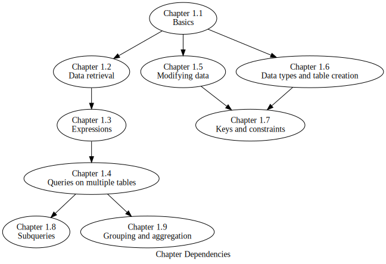

.. _sql-part:

===
SQL
===

Part 1 of this book is all about SQL, the most popular language used for interacting with *relational databases*, the main focus of the book.  The chapters in this section have been organized to allow introducing topics in somewhat different orders according to the instructor's desired approach.  The diagram below shows the strong dependencies between chapters; chapters will assume knowledge introduced in earlier chapters as implied by the graph.  Chapters without a strong dependency may still refer to other chapters in passing, with a link to the chapter explaining the reference; these weak dependencies are not critical for understanding the referencing chapter.

    Chapter dependency graph for Part 1

**Table of contents for Part 1**

.. toctree::
    :maxdepth: 3

    01-sql-basics/sql-basics
    02-data-retrieval/data-retrieval
    03-expressions/expressions
    04-multiple-tables/multiple-tables
    05-data-modification/data-modification
    06-table-creation/table-creation
    07-constraints/constraints
    08-subqueries/subqueries
    09-grouping-and-aggregation/grouping-and-aggregation
    10-set-operations/set-operations
    11-advanced-topics/advanced-topics

|license-notice|
