.. _erd-chapter:

============================
Entity-relationship diagrams
============================

This chapter introduces *entity-relationship diagrams*, or ERDs.  ERDs define a graphical language for data modeling, at a high level of abstraction.  ERDs map well to relational databases at a high level, but can also be used as a precursor to building non-relational databases.

ERDs were conceived of by Peter Chen and described in a :ref:`1976 paper <data-modeling-references>`.  While various approaches to data modeling existed before ERD, Chen's ERD has stood the test of time to become one of the preferred methods and is in wide use today.  Many authors have expanded upon Chen's basic model, extending the notation in different directions.  As a result, there are many different ERD notations in use.  For this book, we adopt the notation of :ref:`Elmasri and Navathe <data-modeling-references>`.

As we cover the various elements of the ERD notation, our examples will build pieces of a data model for a fictional computer manufacturer.  The complete model is given in :numref:`Section {number} <complete-model-section>` below.  You can also find ERDs for some of the datasets used in :numref:`Part {number} <sql-part>` in :ref:`appendix-a`.

Basic model
:::::::::::

As the name suggests, ERDs are concerned with *entities* and the *relationships* between them.  Each of these elements and related elements are denoted using simple shapes, containing text labels, and connected with straight lines.

Entities
--------

Entities represent things or objects with independent existence; persons, products, and companies are some examples.  Entities act much like the "nouns" of our visual modeling language.  Entities are denoted by rectangles; the rectangle is labeled with a name indicative of the concept being modeled:

It is important to distinguish between an entity, which is a model of the thing or object being modeled, and instances of the entity, e.g., a particular thing or object.  The entity **employee** models all employees, not a specific employee of a company.

Attributes
----------

Entities are further described by their properties, or *attributes*.  Attributes are denoted by ovals, and attached to their entities with straight lines.  For example, employees have names:

You can attach as many attributes as necessary to an entity.

Keys
----

Every entity has at least one attribute that uniquely identifies instances of the entity.  These *key attributes* are indicated by underlining the attribute label.  For our computer company, each employee is given an ID number for unique identification:

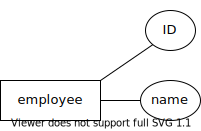

ERD allows for multiple key attributes; for example, we might wish to also store a government issued identification number (such as the SSN used in the United States) for each employee.  In this case, we would have two attributes with underlined labels.  Note that this is not the same as a key attribute composed of multiple parts!  An employee can be uniquely identified by either their company ID or by their government issued identification number - you do not need to know both.  Composite keys will be discussed in a later section.

Relationships
-------------

Two or more entities may participate in a relationship.  Relationships act like the "verbs" in our modeling language.  Relationships are denoted by diamonds, and are connected to the participating entities by straight lines:

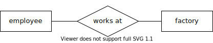

This diagram reads like a sentence: "employee works at factory".  Note that no direction is implied by the layout of the diagram; you have to use your knowledge of the data domain to know that the diagram probably does not mean "factory works at employee".

Cardinality ratios and participation
-------------------------------------

How many employees work at a factory, and how many factories can an employee work at?  This is important information for our model (and for the database we will create from it).

*Cardinality ratios* let us indicate the general number of instances of an entity that map to an entity on the other side of the relationship, and vice versa.  The cardinalities defined by the basic model are **1** and **N** (or **n**).  A cardinality of **1** actually means "zero or one"; a cardinality of **N** means "zero, one, or many".  As most relationships are binary (involving only two participating entities), there are a small number of commonly occurring cardinality ratios:

- 1:1, read as "one-to-one"
- 1:N, read as "one-to-many" (equivalently, N:1, or "many-to-one")
- N:M or N:N, read as "many-to-many"

We show the cardinalities on our model next to the line connecting the relationship to the entity:

.. image:: relationship_with_cardinalities.svg
    :alt: The works at relationship, annotated with an "N" on the employee side and a "1" on the factory side

This diagram's cardinality ratio implies two statements about the relationship between employees and factories.  First, "each employee works at zero or one factories".  Second, "each factory has zero or more employees working at it".

*Participation* is a closely related topic.  An entity is said to have *total participation* in a relationship if every instance of the entity must be matched with instances of the other entity in the relationship.  In effect, this provides a minimum cardinality for the entity on the other side of the relationship.  Here is an example - note this is a second relationship between **employee** and **factory**:

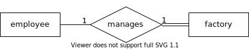

The double line between **factory** and **manages** says that **factory** has total participation in the relationship.  This diagram's cardinality ratio and participation imply two subtly different statements: "each employee manages *zero or one* factories" and "each factory has *exactly one* employee managing it".  That is, every factory is expected to have a manager, but only some employees manage a factory.

The opposite of total participation, denoted using a single line, is *partial participation*.

While indicating total participation on an ERD provides useful information, it is not as critical as cardinality ratios.  As we will see in :numref:`Chapter {number} <erd-to-relational-chapter>`, total participation can influence some decisions when converting our diagram to a relational database (particularly for 1:1 relationships), but its absence is generally not harmful.

Putting it together
-------------------

Below is a diagram incorporating the examples above, and with some additional attributes to fill out the entities:

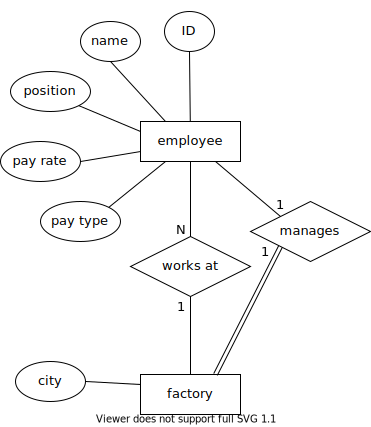

Note that the **factory** entity does not use a generated key, but a "natural" one - the city in which the factory is located.  (This only works if our company has no more than one factory in a city!)

While this is only part of the complete model that we will ultimately develop, it is a valid ERD from which we could build a database.  All of the necessary detail is in place.

There is also no unnecessary duplication of information in our model.  It is tempting to add attributes or other features that anticipate the database to come; for example, we might think that employees should have an attribute indicating at which factory they work.  However, the fact that (at least some) employees work at a factory is already implicit in the relationship **works at**.  This relationship will give rise to the necessary database structures connecting employees to factories.

More complex modeling options
:::::::::::::::::::::::::::::

This section will look at some cases not covered in the examples above, and also reveal some additional notation covering situations not addressed by the basic model above.

Recursive relationships
-----------------------

Relationships can exist between an entity and itself.  This is frequently useful, especially in modeling hierarchical relationships.  In our fictional computer company, each employee (except for the head of the company) has a supervisor, who is another employee.  This is easily modeled as a one-to-many relationship connecting **employee** to **employee**:

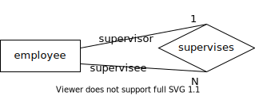

For added clarity, we have annotated the lines connecting the relationship with the roles that employees play in the relationship: one supervisor supervises many supervisees.

Weak entities
-------------

In some situations, we may want to model an entity for which we do not have a unique identifier, but which can be uniquely identified in relationship with another entity.  As an example, each of the factories of our computer manufacturer will contain assembly lines.  We wish to track certain information about each assembly line in our database, such as the daily *throughput* of the assembly line (the number of computers it can produce in a day).  We wish to model these as an entity in our data model, but it is not immediately clear what property of an assembly line would make a good identifier.

We could, of course, give every assembly line a generated unique identifier, but there is a more natural way to identify assembly lines.  In each factory, assembly lines are simply numbered starting from 1, most likely in order by their position on the factory floor.  To identify a particular assembly line, we first state which factory it is in, and then its number within the factory.

When an entity is dependent on another entity for full identification, the dependent entity is called a *weak entity*, and we notate it using a rectangle with doubled outline.  The weak entity has only a partial, or weak, key - in our example, the number of the assembly line within the factory.  We note the weak key using a dashed underline.  We also call out the relationship that the weak entity depends on for its identity, to distinguish it from any other relationships the weak entity participates in.  We call this relationship the *identifying relationship*, and draw it as a diamond with doubled outline.  The key of the parent entity together with the weak key of the weak entity constitutes a unique identifier for instances of the weak entity.

Here is the diagram of our assembly line example:

.. image:: weak_entity.svg
    :alt: The weak entity assembly line and the entity factory and their attributes, connected by the one-to-many relationship contains; assembly line has attributes number and throughput

Composite attributes
--------------------

We may sometimes wish to model an attribute that is naturally composed of multiple parts.  For example, the address of a person or company may be composed of a street address, city, postal code, and so forth.  To indicate that these attributes work together as part of a larger property of the entity, we can use a *composite attribute*, which is drawn as a regular attribute with its component attributes attached.

The use of a composite attribute is essential in cases where our key is itself composed of multiple attributes.  We cannot simply underline each component of the key, as this would indicate that each is a key by itself.  Instead, we must create a composite attribute; we underline the composite, but not the component attributes.

In our computer manufacturer example, each type of computer (or "model") the company builds is identified by a name (indicating some line of computers), and a number (indicating the version of that line of computers).  For lack of a better name, we group these as a composite labeled "designation":

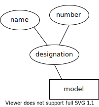

Multivalued attributes
----------------------

Some properties of entities are not simple values, but lists or sets of values.  As these will need special handling when we create a database from the data model, we differentiate these *multivalued attributes* from regular attributes using a doubled outline:

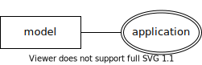

In our example, computer models may be designed or marketed for particular applications, such as gaming, multimedia, or business.  As computers may fit into more than one of these categories, we model it above as a multivalued attribute.

An alternative to making a multivalued attribute is modeling the possible attribute values as a separate entity, connected to the original entity with a many-to-many relationship.  The separate entity would have only the single attribute, and its instances would represent the possible values that can be associated with the original entity.

Derived attributes
------------------

Entities may have important properties that we want to note on our data model, but which we would prefer to compute from other values in the data model, rather than store in our database.  For example, the age of a person is an important property for many applications, but storing this value in the database is generally a poor choice, as a person's age changes over time, necessitating regular updates to the data.  Instead, we might store the person's birth date, and calculate the person's age each time we need it.

In our computer manufacturer example, we are interested in the total throughput of each factory.  While we could make this an attribute of **factory**, we note that a factory's throughput can be calculated by summing up the throughputs of the factory's assembly lines.  We model these calculated properties as *derived attributes*, using a dashed outline:

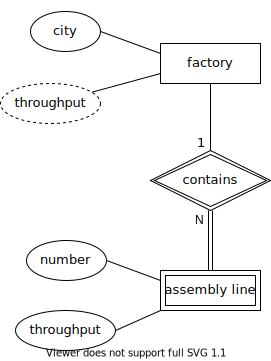

Relationship attributes
-----------------------

While most attributes are attached to entities, we can also attach attributes to relationships.  We do this when an attribute properly applies to a combination of entities, rather than to a single entity.  This most frequently occurs with many-to-many relationships.

Our fictional computer manufacturer buys computer parts from multiple vendors.  The manufacturer considers certain parts that have similar properties to be a single "part".  For example, the database might contain an entry for the part "8TB 7200RPM hard drive", regardless of brand.  However, at any given time, one vendor's price for a given part may be different from another vendor's price for the same part.  This price therefore cannot belong to the **part** entity - it depends on **vendor**, too.  Similarly, vendors supply many different parts, so the price cannot belong to the **vendor** entity.  Instead, it belongs to the relationship between these entitites:

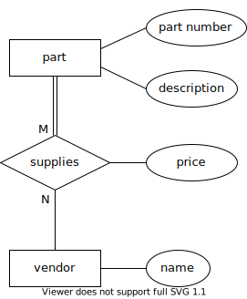

Higher-arity relationships
--------------------------

We stated that two *or more* entities could participate in a relationship.  While most relationships are binary, you may run into cases where you need to relate three (or more) entities.  We do not have an example of this in our model.  However, a classic example arises in the context of large organizations or government agencies with many projects involving complex contracts with parts suppliers.  Projects use many parts, and parts may be used in multiple projects; additionally, the same part might be available from different vendors.  Normally this might be modeled using two many-to-many relationships (very much like what is in our computer manufacturer model).  However, if the company has legal agreements that, for a certain project, a certain type of part must come from a certain vendor, while for a different project, the same type of part must come from a different vendor, the situation is not easily modeled using binary relationships.  What we need is a relationship that connects parts, projects, and vendors.

In this example, the relationship is many-to-many-to-many, which may be notated as M:N:P or N:N:N:

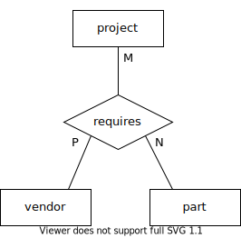

.. _complete-model-section:

Complete example
::::::::::::::::

Below is our completed example; most parts of the diagram have been explained above.  Now that you know what the different elements mean, the rest of the diagram should be self-explanatory:

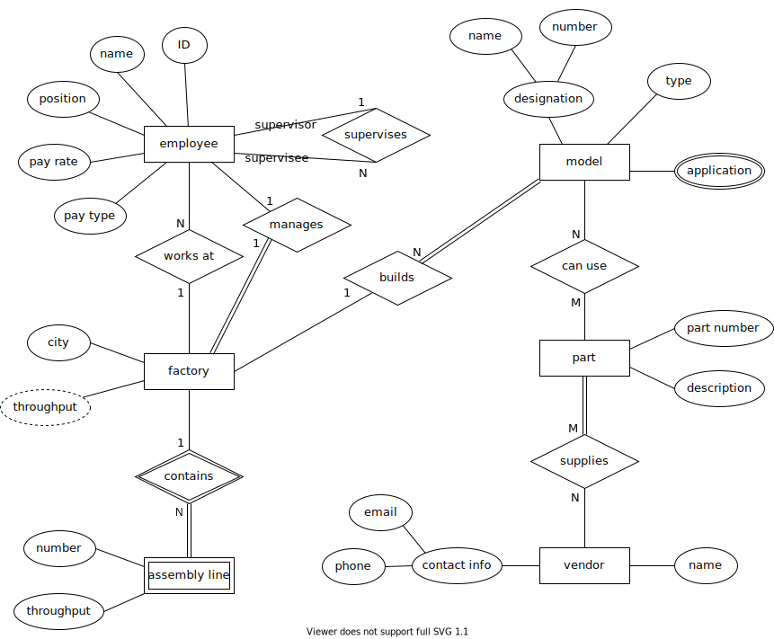

Using ERD to design a database
:::::::::::::::::::::::::::::::

While ERD has many applications, we emphasize its use as an analysis and design tool.  ERDs facilitate communication between database developers, programmers, domain experts, and database users.  An ERD produces an abstract model of *the data*.  Although we will examine how to turn our ERD into a relational database in :numref:`Chapter {number} <erd-to-relational-chapter>`, the ERD contains no details specific to SQL or relational databases.  Especially in the early stages of analysis, thinking ahead to such details can actually be counterproductive; your focus should be on creating a shared understanding of the data.

In a similar vein, we encourage you to avoid spending effort on perfect conformance to the ERD notation.  In the interest of improved communication, you should feel free to adapt the notation to your needs.  You can (and perhaps should) add text explanations wherever they are helpful - designing a large database is a complex endeavor, and it can be easy to forget the reasons for particular design decisions.  Notational details will become more important in the later stages of design, however, as you begin to test your design with actual database construction.

The actual process you use to create a database for a project may be dictated by your project group or organization, but some general advice is provided below.

Analysis
--------

A crucial first step in the design of any software is understanding the requirements of your project.  In regards to your database, requirements may be dictated by:

- the data domain, i.e., facts which impose structure and relationships on the data
- user needs, e.g., the answers or insights they want to obtain from the data
- data sources, e.g., the data values that are actually available to be stored
- application requirements, e.g., how other software will view or manipulate the data

You may therefore need to talk with domain experts (people who have deep knowledge about the area the data applies to), end users, data providers, and software developers.  Brainstorming entities, attributes, and relationships is a great starting point for these discussions.  List data elements on a whiteboard or piece of paper where everyone can see.  Some of these are potential entities, some attributes, and some may even be relationships.  Have people propose relationships between the data elements, and write these as simple "subject verb object" sentences.  It is not necessary to be exhaustive in your brainstorming; additional entities, attributes, and relationships will be discovered in later steps.

Once you have a good set of data elements and relationships, you can begin working on an ERD.  Focus at first on basic model elements - entities, attributes, and relationships.  Identify potential key attributes for all of your entities.  Consider cardinality ratios; examine whether these make sense by the statements they imply about the entities involved, e.g., "each instance of this entity has this relationship with *x* number of instances of the other entity".  Question all assumptions!  For example, if you identify some attribute as a key for an entity, ask if every instance of the entity actually has that attribute.

It may take significant time and multiple discussions to build an ERD that is satisfactory to everyone involved.  This process is messy and may seem chaotic at first.  Be patient, try different options, and make incremental improvements.  It is not necessary to solve every disagreement before moving on to next steps; you may need to revisit the ERD multiple times as you uncover questions and issues in later steps.

Design, implementation, and beyond
----------------------------------

You can build a database as the next step once you have an ERD, or you can engage in further design activities.  You may wish to build a lower level data model, such as a *logical model* (discussed in :numref:`Chapter {number} <other-notations-chapter>`) as an intermediate step.  Some of this will depend on interactions with other systems (e.g., software) being built.  As will be discussed in :numref:`Chapter {number} <erd-to-relational-chapter>`, the ERD does not fully dictate how your database will be built; for instance, you need to choose table and column names (for a relational database), as well as data types for the different values represented by attributes in your ERD.

Regardless of next step, you are likely to run into problems of some sort: assumptions that do not hold, new questions, or other issues in translating the ERD into a more concrete form.  As part of your process, expect to revisit the design with your domain experts and project stakeholders to resolve these problems.  This will probably happen yet again when you start trying to put data into your new database, when software is written to interact with the database, and when users start testing the database and/or software.

Whether you resolve issues at each stage with the ERD or at some lower level, it can be valuable to keep the ERD aligned with the database as implemented, as part of your documentation of the system.  Systems change over time; when it is time to modify your database, you will want some documentation of the design decisions that went into the earlier database, and the ERD may play a part in designing the updates to your system.  An up-to-date ERD will also help new database users or software developers become acquainted with the system more quickly.

Self-check exercises
::::::::::::::::::::

This section has some questions you can use to check your understanding of entity-relationship diagrams and data modeling.

.. fillintheblank:: erd_self_test_elements_1

   Which data element models a thing or object with independent existence, such as a person, product, or company?

   - :entity: Correct.  Entities act as the "nouns" of our data model.
     :.*: Try again.  Be sure your answer is in all lowercase.

.. reveal:: erd_self_test_elements_1_hint
     :showtitle: Show answer
     :hidetitle: Hide answer

     The answer is "entity".

.. fillintheblank:: erd_self_test_elements_2

    An |blank| describes a property of an entitthe material in this chaptery.

    - :attribute:   Correct.
      :.*: Try again.  Be sure your answer is in all lowercase.

.. reveal:: erd_self_test_elements_2_hint
    :showtitle: Show answer
    :hidetitle: Hide answer

    The answer is "attribute".

.. fillintheblank:: erd_self_test_elements_3

   Which data element connects two or more entities and acts as a "verb" in our data model?

   - :relationship:   Correct.
     :.*: Try again.  Be sure your answer is in all lowercase.

.. reveal:: erd_self_test_elements_3_hint
     :showtitle: Show answer
     :hidetitle: Hide answer

     The answer is "relationship".

.. dragndrop:: erd_self_test_shapes
    :match_1: rectangle|||entity
    :match_2: oval|||attribute
    :match_3: diamond|||relationship

    Drag the shape to the corresponding model element.

.. mchoice:: erd_self_test_keys

    Suppose you are designing a database to store information about movies.  What might be a good key attribute for your **movie** entity?

    -   Lead actor

        - Many actors, especially lead actors, have worked on many movies.  Lead actor is unlikely to be a unique identifier.

    -   Title

        - Many movies have been remade under the same title (and some movies share a title with unrelated films), so this is not a good unique identifier.

    -   First line of dialogue

        - Probably not.  It might be unique for most films, but probably not all films, and it is a fairly large piece of data to use as key.

    -   Title and year of release (composite)

        + This is the best of the choices given here.  Alternately, you might use an artificially generated id value.

.. mchoice:: erd_self_test_cardinality_1

    Consider the entities and relationship shown here:

    .. image:: self_test_relationship_1.svg
        :alt: Entities A and B connected to an unnamed relationship by single lines, labeled N and M

    Which statement most accurately describes the relationship?

    -   Each instance of A is associated with zero or one instance of B; each instance of B is associated with zero or one instance of A.

        - Incorrect.  What does the label "N" imply about maximum cardinality?

    -   Each instance of A is associated with zero or more instances of B; ecanach instance of B is associated with zero or more instances of A.

        + Correct.  The relationship is many-to-many, with partial participation on both sides.

    -   Each instance of A is associated with one or more instances of B; each instance of B is associated with one or more instances of A.

        - Incorrect.  What is the participation of A and B in the relationship?  What does that imply about the minimum cardinality?

.. mchoice:: erd_self_test_cardinality_2

    Consider the entities and relationship shown here:

    .. image:: self_test_relationship_2.svg
        :alt: Entities C and D connected to an unnamed relationship.  C is connected by a single line labeled 1.  D is connected by a double line labeled N.

    Which statement most accurately describes the relationship?

    -   Each instance of C is associated with zero or one instance of D; each instance of D is associated with one or more instances of C.

        - Incorrect.  Each cardinality label describes the entity on the same side of the relationship.

    -   Each instance of C is associated with zero or more instances of D; each instance of D is associated with exactly one instance of C.

        - Incorrect.  Reconsider the participation on each side of the relationship, and what that implies about minimum cardinality.

    -   Each instance of C is associated with one or more instances of D; each instance of D is associated with zero or one instance of C.

        + Correct.

.. fillintheblank:: erd_self_test_elements_4

   Some entities have instances that cannot be uniquely identified based solely on their attributes, but must be associated with a parent entity instance for full identification.  We call these |blank| entities.

   - :weak:   Correct.
     :.*: Try again.  Be sure your answer is in all lowercase.

.. reveal:: erd_self_test_elements_4_hint
     :showtitle: Show answer
     :hidetitle: Hide answer

     The answer is "weak".

.. mchoice:: erd_self_test_elements_5

     Suppose we are modeling a simple database about books.  For each book we want to include information about the genres the book belongs to.  Many books can belong to more than one genre.  What kind of attribute should we use for genre?

     -  Multivalued

        + Correct.

     -  Derived

        - Probably not, unless genre information can be deduced from some other information stored in the database.

     -  Composite

        - Probably not, although you could make a case for storing a general genre category and a more specific sub-genre.

     -  Key

        - Definitely not.  Many books belong to the same genre, so genre is not a unique identifier for a book.

.. |chapter-end| unicode:: U+274F

|chapter-end|

.. raw:: html

   

   
    <i>A Practical Introduction to Databases</i> by
   
   Christopher Painter-Wakefield is licensed under a
   <a rel="license" href="http://creativecommons.org/licenses/by-nc-sa/4.0/" target="_blank">
   Creative Commons Attribution-NonCommercial-ShareAlike 4.0 International License</a>.

