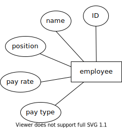
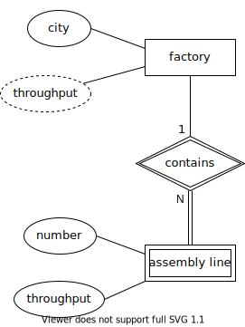
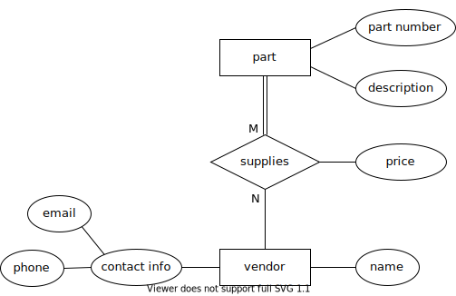
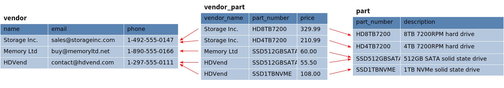
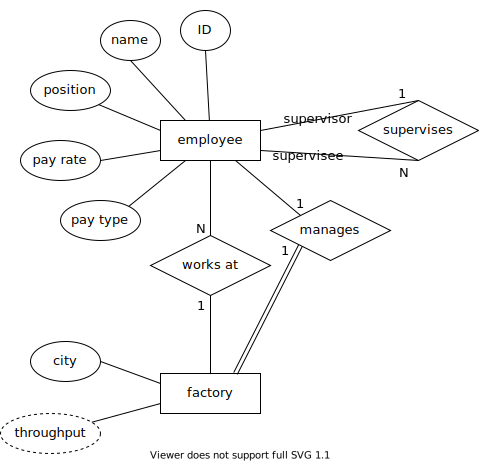
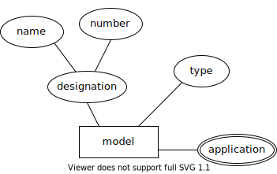

.. _erd-to-relational-chapter:

====================================
Converting ERD to a relational model
====================================

.. |right-arrow| unicode:: U+2192

In this chapter we explain the process of creating a relational database from an entity-relationship model.  While many steps are largely mechanical, a number of decisions need to be made along the way.  We will explore the trade-offs for each decision.  We will use the computer manufacturer data model from :numref:`Chapter {number} <erd-chapter>` as our example.

This chapter assumes you are familiar with the basics of the relational model of the database, including tables and primary and foreign key constraints.  The necessary foundations are covered in either Part I (Chapters 1.1, 1.7) or Part III (Chapters ???).

There are many ways to represent the relational database: logical or physical data models (:numref:`Chapter {number} <other-notations-chapter>`), text or tabular descriptions, or SQL code.  Which you use will depend on your development process and needs.  In this chapter, we will provide simple text descriptions in tabular format.

We start with the basic conversion rules, converting pieces of our example data model as we go.  The full set of tables resulting from our conversion is given at the end of the chapter.

Entities
::::::::

The first step in building a relational database from an ERD is creating a table from each entity in the data model.  Weak entities need slightly different handling than regular entities, so we will address them separately, starting with regular entities.

Regular entities
-----------------

First, decide on a name for the table - this does not have to be the same as the entity name!  There are many naming schemes for tables.  If you are building a database for a company or organization that has naming standards, you will of course want to follow those.  Otherwise, choose a basic approach and be consistent.  For example, some databases use plural nouns for tables, while others use singular nouns.  In our data model from :numref:`Chapter {number} <erd-chapter>`, the entity **employee** might become a table named **employee** or **employees**.  Another naming issue arises with table names containing multiple words; some databases choose to run these together, while others employ underscore characters.  For example, the entity **assembly line** could become a table named **assemblyline** or **assembly_line**.  In our examples below, we will use singular nouns and underscores.

Most attributes for the entity should be converted to columns in the new table.  Do not create columns for derived attributes, as these values are not intended to be stored.  Do not create columns for multivalued attributes; we will address these later.  For composite attributes, create columns only for the component attributes, not the composite itself.  As with entities, you will need to decide on a name for each new column, which does not have to be the same as the attribute name.  You will also need to specify a type and any constraints for the column.  Determining appropriate types for some columns may require consultation with your data domain experts.  Constraints may be added as appropriate.  In the descriptions below, we will use simple type and constraint descriptions, rather than SQL syntax.

Choose a key attribute (every regular entity should have at least one) and use the column created from it as the primary key for the new table.  If the entity has multiple key attributes, you will need to decide which one makes most sense as a primary key.  Simpler primary keys are usually preferred over more complex ones.

Here is our ERD depiction of the **employee** entity:

Here is a preliminary conversion of the **employee** entity into a relational table named **employee**:

.. table:: Table **employee** (preliminary)
    :class: lined-table

    +---------------+----------+--------------+-----------------------------+
    | Column name   | Type     | Constraints  | Notes                       |
    +===============+==========+==============+=============================+
    | id            | integer  | not null     |                             |
    +---------------+----------+--------------+-----------------------------+
    | name          | text     | not null     |                             |
    +---------------+----------+--------------+-----------------------------+
    | position      | text     |              |                             |
    +---------------+----------+--------------+-----------------------------+
    | pay_rate      | currency |              |                             |
    +---------------+----------+--------------+-----------------------------+
    | pay_type      | character| 's' or 'h'   | s = salaried, h = hourly    |
    +---------------+----------+--------------+-----------------------------+
    | **Keys**                                                              |
    |                                                                       |
    | Primary key: id                                                       |
    +---------------+----------+--------------+-----------------------------+

This is not yet the final **employee** table!  We will add additional columns to the table when we address the relationships that **employee** participates in.

Weak entities
-------------

Weak entities are converted into tables in nearly the same way as regular entities.  However, recall that a weak entity has no identifying key attribute.  Instead, it has a partial key, which must be combined with the key of the parent entity.  In our example, the **assembly line** entity is weak.  Its partial key, the number of the assembly line within a particular factory, must be combined with the factory identity for full identification.

The table created from a weak entity must therefore incorporate the key from the parent entity as an additional column.  The primary key for the new table will be composed of the columns created from the parent key and from the partial key.  Additionally, the column created from the parent key should be constrained to always match some key in the parent table, using a foreign key constraint.

Here is the ERD of **assembly line** and its parent entity, **factory**:

Using the above guidelines, we should create tables **factory** and **assembly_line**, and include a column in **assembly_line** for values from the **city** column of **factory**.  A good choice of name for these "borrowed" columns is to concatenate the original table and column names together; in our case, this gives us the column **factory_city**.  (We will use the term "borrow" in reference to this process of inserting a column in one table to hold values from the primary key column of a related table.)  Here is the preliminary conversion of **factory** and the final conversion of **assembly line**:

.. table:: Table **factory** (preliminary)
    :class: lined-table

    +---------------+----------+--------------+-----------------------------+
    | Column name   | Type     | Constraints  | Notes                       |
    +===============+==========+==============+=============================+
    | city          | text     | not null     |                             |
    +---------------+----------+--------------+-----------------------------+
    | **Keys**                                                              |
    |                                                                       |
    | Primary key: city                                                     |
    +---------------+----------+--------------+-----------------------------+

.. table:: Table **assembly_line**
    :class: lined-table

    +---------------+----------+--------------+-----------------------------+
    | Column name   | Type     | Constraints  | Notes                       |
    +===============+==========+==============+=============================+
    | factory_city  | text     | not null     |                             |
    +---------------+----------+--------------+-----------------------------+
    | number        | integer  | not null     |                             |
    +---------------+----------+--------------+-----------------------------+
    | throughput    | real     |              |                             |
    +---------------+----------+--------------+-----------------------------+
    | **Keys**                                                              |
    |                                                                       |
    | Primary key: factory_city, number                                     |
    |                                                                       |
    | Foreign key: factory_city |right-arrow| factory (city)                |
    +---------------+----------+--------------+-----------------------------+

Relationships
:::::::::::::

Relationships can be handled using a few different approaches, depending on the cardinality ratio of the relationship.  Most generally, we can create a table to represent the relationship.  This kind of table is known as a *cross-reference* table, and acts as an intermediary in a three-way join with the two (or more) tables whose entities participate in the relationship.  As we will see, some cardinality ratios permit simpler solutions.

Many-to-many
------------

Many-to-many relationships are the most general type of relationship; a database structure accommodating a many-to-many relationship can also accommodate one-to-many or one-to-one relationships, as "one" is just a special case of "many".  The challenge for many-to-many relationships is how to represent a connection from a record in one table to multiple records in the other table.  While modern SQL allows array valued columns in tables, not all databases support them.  The traditional solution is to create a cross-reference table.

Given a table **A** and a table **B**, we create a cross-reference table with columns corresponding to the primary keys of **A** and **B**.  Each row in the cross-reference table stores one unique pairing of a primary key value from **A** with a primary key value from **B**.  Each row thus represents a single connection between one row in **A** with one row in **B**.  If a row in **A** is related to multiple rows in **B**, then there will be multiple entries with the same **A** primary key value, paired with each related **B** primary key value.

For example, our ERD indicates a many-to-many relationship between the entities **vendor** and **part**.  A computer part (such as an 8TB hard drive) can come from multiple sellers, while sellers can sell multiple different computer parts:

We create tables **vendor** and **part** following the guidelines above, and then create the cross-reference table **vendor_part**.  (It is common to name a cross-reference table using the names of the two tables being related, although other schemes can of course be used.)  Note that the **supplies** relationship also has a relationship attribute, **price**, which we can incorporate into cross-reference table.  The result, with some fictional data, is pictured below:

Data in the cross-reference table is constrained in several ways.  First, we only want to store the relationship between rows once, so we make the combination of primary keys from the related tables into a primary key for the cross-reference table.  In our example, the primary key is the combination of **vendor_name** and **part_number**.  Second, each of the borrowed primary key columns should be constrained to only hold values that are present in the original tables, using foreign key constraints.

Table descriptions for **vendor**, **part**, and the **vendor_part** cross-reference table are given below:

.. table:: Table **vendor**
    :class: lined-table

    +---------------+----------+--------------+-----------------------------+
    | Column name   | Type     | Constraints  | Notes                       |
    +===============+==========+==============+=============================+
    | name          | text     | not null     |                             |
    +---------------+----------+--------------+-----------------------------+
    | email         | text     |              |                             |
    +---------------+----------+--------------+-----------------------------+
    | phone         | text     |              |                             |
    +---------------+----------+--------------+-----------------------------+
    | **Keys**                                                              |
    |                                                                       |
    | Primary key: name                                                     |
    +---------------+----------+--------------+-----------------------------+

.. table:: Table **part**
    :class: lined-table

    +---------------+----------+--------------+-----------------------------+
    | Column name   | Type     | Constraints  | Notes                       |
    +===============+==========+==============+=============================+
    | part_number   | text     | not null     |                             |
    +---------------+----------+--------------+-----------------------------+
    | description   | text     |              |                             |
    +---------------+----------+--------------+-----------------------------+
    | **Keys**                                                              |
    |                                                                       |
    | Primary key: part_number                                              |
    +---------------+----------+--------------+-----------------------------+

.. table:: Table **vendor_part**
    :class: lined-table

    +---------------+----------+--------------+-----------------------------+
    | Column name   | Type     | Constraints  | Notes                       |
    +===============+==========+==============+=============================+
    | vendor_name   | text     | not null     |                             |
    +---------------+----------+--------------+-----------------------------+
    | part_number   | text     | not null     |                             |
    +---------------+----------+--------------+-----------------------------+
    | price         | currency |              |                             |
    +---------------+----------+--------------+-----------------------------+
    | **Keys**                                                              |
    |                                                                       |
    | Primary key: vendor_name, part_number                                 |
    |                                                                       |
    | Foreign key: vendor_name |right-arrow| vendor (name)                  |
    |                                                                       |
    | Foreign key: part_number |right-arrow| part (part_number)             |
    +---------------+----------+--------------+-----------------------------+

One-to-many
-----------

As a special case of many-to-many relationships, one-to-many relationships can be implemented in the database using a cross-reference table as above.  We have another choice, however.  Observing that rows on the "many" side of the relationship can be associated with at most one row from the "one" side, we can choose to capture the relationship by storing the primary key of the "one" side table in the "many" side table.

In our ERD, the **employee** entity participates in one-to-many relationships with both **factory** and itself:

There is also a one-to-one relationship between **employee** and **factory**, which we will deal with in the next section.

Considering first the **works at** relationship, we see that each employee works at at most one factory.  Therefore, we can include a column for the factory city in the **employee** table.  For consistency with previous choices, we will call this column **factory_city**.  This column should be constrained by a foreign key referencing the **factory** table.

We also have the **supervises** relationship to deal with.  In the same fashion as above, we should include a column in the **employee** table containing primary keys from the **employee** table.  However, we should give careful consideration to the name we give this added column; **employee_id** would be a very misleading choice!  A better choice is to consider the role of the employee whose id will be stored, and call the column **supervisor_id**.

With these changes, the **employee** table now looks like:

.. table:: Table **employee**
    :class: lined-table

    +---------------+----------+--------------+-----------------------------+
    | Column name   | Type     | Constraints  | Notes                       |
    +===============+==========+==============+=============================+
    | id            | integer  | not null     |                             |
    +---------------+----------+--------------+-----------------------------+
    | name          | text     | not null     |                             |
    +---------------+----------+--------------+-----------------------------+
    | position      | text     |              |                             |
    +---------------+----------+--------------+-----------------------------+
    | pay_rate      | currency |              |                             |
    +---------------+----------+--------------+-----------------------------+
    | pay_type      | character|   's' or 'h' | s = salaried, h = hourly    |
    +---------------+----------+--------------+-----------------------------+
    | factory_city  | text     |              |                             |
    +---------------+----------+--------------+-----------------------------+
    | supervisor_id | integer  |              |                             |
    +---------------+----------+--------------+-----------------------------+
    | **Keys**                                                              |
    |                                                                       |
    | Primary key: id                                                       |
    |                                                                       |
    | Foreign key: factory_city |right-arrow| factory (city)                |
    |                                                                       |
    | Foreign key: supervisor_id |right-arrow| employee (id)                |
    +---------------+----------+--------------+-----------------------------+

Using a cross-reference table instead of the above scheme is a perfectly valid choice, and may be preferable if there is any chance the data model might change such that the one-to-many relationship becomes many-to-many.  In our example ERD, a given computer model is built at only one factory (while factories can build multiple different models); however, it would not be surprising if, at some point, we want to allow for models to be built at multiple locations.  We might choose to use a cross-reference table for the relationship between **factory** and **model** in anticipation of this possibility.

One-to-one
----------

One-to-one relationships can be considered a special case of one-to-many relationships, so you can utilize either approach suitable for one-to-many relationships.  In most cases, it will be preferable to borrow the primary key from one table as a foreign key in the other table.  Using this approach, you could borrow from either side; however, one choice is often preferable to another.

In our example, we have a one-to-one relationship, **manages**, between **employee** and **factory**.  We could therefore add another column to the **employee** table, this time for the city of the factory that the employee manages.  However, most employees do not manage factories, so the column will end up containing many ``NULL`` values.

On the other hand, every factory should have a manager (implied by the total participation of **factory** in the relationship). It makes perfect sense, then, to add a column to the **factory** table for the employee managing the factory.  This is another situation in which it makes sense to name the column for the role of the employee in this relationship, so we will call the new column **manager_id**.

Here is the completed **factory** table:

.. table:: Table **factory**
    :class: lined-table

    +---------------+----------+--------------+-----------------------------+
    | Column name   | Type     | Constraints  | Notes                       |
    +===============+==========+==============+=============================+
    | city          | text     | not null     |                             |
    +---------------+----------+--------------+-----------------------------+
    | manager_id    | integer  |see note [#]_ |                             |
    +---------------+----------+--------------+-----------------------------+
    | **Keys**                                                              |
    |                                                                       |
    | Primary key: city                                                     |
    |                                                                       |
    | Foreign key: manager_id |right-arrow| employee (id)                   |
    +---------------+----------+--------------+-----------------------------+

In some rare cases, it may make sense to handle a one-to-one relationship by simply merging the participating tables into one table.  This should probably be reserved for situations in which both entities have total participation in the relationship.

Higher arity relationships
--------------------------

For relationships with three or more participants, a cross-reference table incorporating primary keys from each of the participating tables is the best choice.

Identifying relationships
-------------------------

Identifying relationships for weak entities are necessarily one-to-many or one-to-one.  However, the conversion of the weak entity already incorporates a column containing primary key values from the parent table.  This suffices to capture the relationship.

Multivalued attributes
::::::::::::::::::::::

Multivalued attributes can be used to model a few different scenarios.  As a result, there are multiple choices for how to store multivalued data in a relational database.

In the simplest case, a multivalued attribute is used when a list of arbitrary values needs to be stored, but there is no particular expectation that the values will be examined in a search of the database.  In this case, an array-valued column may be an appropriate choice for databases that support such columns.

When there is a need to query the values associated with a multivalued attribute, or for databases that do not support array-valued columns, the best choice may be to make a simple table with two columns, one for the primary key of the owning table, and one for the values themselves.  Each entry in the table associates one value with the instance of the entity.

In our example, computer models can be marketed to customers for different applications, such as gaming, video editing, or business use.  This is represented in our data model with the multivalued **application** attribute:

We might, then, implement the model entity and its attributes using the following two tables:

.. table:: Table **model** (preliminary)
    :class: lined-table

    +---------------+----------+--------------+-----------------------------+
    | Column name   | Type     | Constraints  | Notes                       |
    +===============+==========+==============+=============================+
    | name          | text     | not null     |                             |
    +---------------+----------+--------------+-----------------------------+
    | number        | text     | not null     |                             |
    +---------------+----------+--------------+-----------------------------+
    | type          | text     |              |                             |
    +---------------+----------+--------------+-----------------------------+
    | **Keys**                                                              |
    |                                                                       |
    | Primary key: name, number                                             |
    +---------------+----------+--------------+-----------------------------+

.. table:: Table **model_application** (preliminary)
    :class: lined-table; in this case

    +---------------+----------+--------------+----------------------------------+
    | Column name   | Type     | Constraints  | Notes                            |
    +===============+==========+==============+==================================+
    | model_name    | text     | not null     |                                  |
    +---------------+----------+--------------+----------------------------------+
    | model_number  | text     | not null     |                                  |
    +---------------+----------+--------------+----------------------------------+
    | application   | text     | not null     |                                  |
    +---------------+----------+--------------+----------------------------------+
    | **Keys**                                                                   |
    |                                                                            |
    | Primary key: model_name, model_number, application                         |
    |                                                                            |
    | Foreign key: (model_name, model_number) |right-arrow| model (name, number) |
    +---------------+----------+--------------+----------------------------------+

Many applications also require the values associated with a multivalued attribute to be restricted to a certain list of values.  In this case, an additional table is used.  The additional table exists just to contain the allowed values, allowing us to constrain the data to just those values.  For more complex values, a artificial identifier may be added as primary key, and the primary key used in the multivalued attribute table instead of the values themselves, in which case the multivalued attribute table becomes a cross-reference table. For small lists of simple values (as in our example) this adds unnecessary complication.

For our example, we will constrain the **application** column using a foreign key constraint referencing this simple table:

.. table:: Table **application**
    :class: lined-table

    +---------------+----------+--------------+-----------------------------+
    | Column name   | Type     | Constraints  | Notes                       |
    +===============+==========+==============+=============================+
    | application   | text     | not null     | gaming, business, etc.      |
    +---------------+----------+--------------+-----------------------------+
    | **Keys**                                                              |
    |                                                                       |
    | Primary key: application                                              |
    +---------------+----------+--------------+-----------------------------+

Full model conversion
:::::::::::::::::::::

In this section, we collect together all of the tables produced from our example data model, using the approach outlined above.  For each table we include a short explanation of how the table relates to the data model.

.. table:: Table **employee**
    :class: lined-table

    +---------------+----------+--------------+-----------------------------+
    | Column name   | Type     | Constraints  | Notes                       |
    +===============+==========+==============+=============================+
    | id            | integer  | not null     |                             |
    +---------------+----------+--------------+-----------------------------+
    | name          | text     | not null     |                             |
    +---------------+----------+--------------+-----------------------------+
    | position      | text     |              |                             |
    +---------------+----------+--------------+-----------------------------+
    | pay_rate      | currency |              |                             |
    +---------------+----------+--------------+-----------------------------+
    | pay_type      | character| 's' or 'h'   | s = salaried, h = hourly    |
    +---------------+----------+--------------+-----------------------------+
    | factory       | text     |              |                             |
    +---------------+----------+--------------+-----------------------------+
    | supervisor_id | integer  |              |                             |
    +---------------+----------+--------------+-----------------------------+
    | **Keys**                                                              |
    |                                                                       |
    | Primary key: id                                                       |
    |                                                                       |
    | Foreign key: factory_city |right-arrow| factory (city)                |
    |                                                                       |
    | Foreign key: supervisor_id |right-arrow| employee (id)                |
    +---------------+----------+--------------+-----------------------------+

Table **employee** contains columns for the attributes of the **employee** entity, and foreign keys implementing the relationships **works at** and **supervises**.

.. table:: Table **factory**
    :class: lined-table

    +---------------+----------+--------------+-----------------------------+
    | Column name   | Type     | Constraints  | Notes                       |
    +===============+==========+==============+=============================+
    | city          | text     | not null     |                             |
    +---------------+----------+--------------+-----------------------------+
    | manager_id    | integer  |              |                             |
    +---------------+----------+--------------+-----------------------------+
    | **Keys**                                                              |
    |                                                                       |
    | Primary key: city                                                     |
    |                                                                       |
    | Foreign key: manager_id |right-arrow| employee (id)                   |
    +---------------+----------+--------------+-----------------------------+

Table **factory** contains columns for the attributes of the **factory** entity, and a foreign key implementing the relationship **manages**.  The **throughput** attribute is not reflected in the table, as it is a derived attribute.  The throughput of a factory can be computed by summing the throughputs of the assembly lines in the factory.

.. table:: Table **assembly_line**
    :class: lined-table

    +---------------+----------+--------------+-----------------------------+
    | Column name   | Type     | Constraints  | Notes                       |
    +===============+==========+==============+=============================+
    | factory_city  | text     | not null     |                             |
    +---------------+----------+--------------+-----------------------------+
    | number        | integer  | not null     |                             |
    +---------------+----------+--------------+-----------------------------+
    | throughput    | real     |              |                             |
    +---------------+----------+--------------+-----------------------------+
    | **Keys**                                                              |
    |                                                                       |
    | Primary key: factory_city, number                                     |
    |                                                                       |
    | Foreign key: factory_city |right-arrow| factory (city)                |
    +---------------+----------+--------------+-----------------------------+

Table **assembly_line** implements the **assembly line** weak entity.  It incorporates a foreign key referencing the **factory** parent entity.  Its primary key is composed of the parent entity key (**factory_city**) and the partial key (**number**).

.. table:: Table **model**
    :class: lined-table

    +---------------+----------+--------------+-----------------------------+
    | Column name   | Type     | Constraints  | Notes                       |
    +===============+==========+==============+=============================+
    | name          | text     | not null     |                             |
    +---------------+----------+--------------+-----------------------------+
    | number        | text     | not null     |                             |
    +---------------+----------+--------------+-----------------------------+
    | type          | text     |              |                             |
    +---------------+----------+--------------+-----------------------------+
    | factory_city  | text     |              |                             |
    +---------------+----------+--------------+-----------------------------+
    | **Keys**                                                              |
    |                                                                       |
    | Primary key: name, number                                             |
    |                                                                       |
    | Foreign key: factory_city |right-arrow| factory (city)                |
    +---------------+----------+--------------+-----------------------------+

Table **model** contains columns for the attributes of the **model** entity.  Only the component attributes of the composite attribute **designation** are included; as **designation** was also the key attribute for **model**, the **model** table has a composite primary key.  The table also includes a foreign key implementing the **builds** relationship.  As mentioned in the text above, the **builds** relationship could alternately be implemented using a cross-reference table connecting **factory** and **builds**, but we have opted for the simpler solution here.  We assume the designation of computer models includes the name of the computer line (e.g. "Orion") and some particular version of the computer line, which we call the "number" of the model.  These versions may contain letters as well as numbers (e.g., "xz450"), which is why a column named "number" is implemented as text.

.. table:: Table **model_application**
    :class: lined-table; in this case

    +---------------+----------+--------------+----------------------------------+
    | Column name   | Type     | Constraints  | Notes                            |
    +===============+==========+==============+==================================+
    | model_name    | text     | not null     |                                  |
    +---------------+----------+--------------+----------------------------------+
    | model_number  | text     | not null     |                                  |
    +---------------+----------+--------------+----------------------------------+
    | application   | text     | not null     |                                  |
    +---------------+----------+--------------+----------------------------------+
    | **Keys**                                                                   |
    |                                                                            |
    | Primary key: model_name, model_number, application                         |
    |                                                                            |
    | Foreign key: (model_name, model_number) |right-arrow| model (name, number) |
    |                                                                            |
    | Foreign key: application |right-arrow| application (application)           |
    +---------------+----------+--------------+----------------------------------+

The table **model_application** implements the multivalued attribute **application** of the **model** entity.  Each row of the table contains a single **application** value describing a particular computer model.  Note that, as the **model** entity had a composite primary key, the **model_application** table has a composite foreign key referencing its parent (*not* two separate foreign keys for each component of the parent key).  Additionally, we constrain the values in **application** to come from a set list of possible values, contained in the **application** table (below).

.. table:: Table **application**
    :class: lined-table

    +---------------+----------+--------------+-----------------------------+
    | Column name   | Type     | Constraints  | Notes                       |
    +===============+==========+==============+=============================+
    | application   | text     | not null     | gaming, business, etc.      |
    +---------------+----------+--------------+-----------------------------+
    | **Keys**                                                              |
    |                                                                       |
    | Primary key: application                                              |
    +---------------+----------+--------------+-----------------------------+

The **application** table contains a simple list of unique values available to insert into the **model_application** table.

.. table:: Table **part**
    :class: lined-table

    +---------------+----------+--------------+-----------------------------+
    | Column name   | Type     | Constraints  | Notes                       |
    +===============+==========+==============+=============================+
    | part_number   | text     | not null     |                             |
    +---------------+----------+--------------+-----------------------------+
    | description   | text     |              |                             |
    +---------------+----------+--------------+-----------------------------+
    | **Keys**                                                              |
    |                                                                       |
    | Primary key: part_number                                              |
    +---------------+----------+--------------+-----------------------------+

Table **part** contains columns for the attributes of the **part** entity.  The column **part_number** here, similar to the model "number" above, can contain characters as well as numbers, so again we use a text type column.

.. table:: Table **model_part**
    :class: lined-table

    +---------------+----------+--------------+----------------------------------+
    | Column name   | Type     | Constraints  | Notes                            |
    +===============+==========+==============+==================================+
    | model_name    | text     | not null     |                                  |
    +---------------+----------+--------------+----------------------------------+
    | model_number  | text     | not null     |                                  |
    +---------------+----------+--------------+----------------------------------+
    | part_number   | text     | not null     |                                  |
    +---------------+----------+--------------+----------------------------------+
    | **Keys**                                                                   |
    |                                                                            |
    | Primary key: model_name, model_number, part_number                         |
    |                                                                            |
    | Foreign key: (model_name, model_number) |right-arrow| model (name, number) |
    |                                                                            |
    | Foreign key: part_number |right-arrow| part (part_number)                  |
    +---------------+----------+--------------+----------------------------------+

Table **model_part** is a cross-reference table implementing the **can use** relationship.

.. table:: Table **vendor**
    :class: lined-table

    +---------------+----------+--------------+-----------------------------+
    | Column name   | Type     | Constraints  | Notes                       |
    +===============+==========+==============+=============================+
    | name          | text     | not null     |                             |
    +---------------+----------+--------------+-----------------------------+
    | email         | text     |              |                             |
    +---------------+----------+--------------+-----------------------------+
    | phone         | text     |              |                             |
    +---------------+----------+--------------+-----------------------------+
    | **Keys**                                                              |
    |                                                                       |
    | Primary key: name                                                     |
    +---------------+----------+--------------+-----------------------------+

Table **vendor** contains columns for the attributes of the **vendor** entity.  Only the component attributes of the **contact info** attribute are reflected.

.. table:: Table **vendor_part**
    :class: lined-table

    +---------------+----------+--------------+-----------------------------+
    | Column name   | Type     | Constraints  | Notes                       |
    +===============+==========+==============+=============================+
    | vendor_name   | text     | not null     |                             |
    +---------------+----------+--------------+-----------------------------+
    | part_number   | text     | not null     |                             |
    +---------------+----------+--------------+-----------------------------+
    | price         | currency |              |                             |
    +---------------+----------+--------------+-----------------------------+
    | **Keys**                                                              |
    |                                                                       |
    | Primary key: vendor_name, part_number                                 |
    |                                                                       |
    | Foreign key: vendor_name |right-arrow| vendor (name)                  |
    |                                                                       |
    | Foreign key: part_number |right-arrow| part (part_number)             |
    +---------------+----------+--------------+-----------------------------+

Table **vendor_part** is a cross-reference table implementing the **supplies** relationship.  In addition to the foreign keys for the tables it relates, it contains a column for the **price** attribute of the relationship.

.. |chapter-end| unicode:: U+274F

|chapter-end|

----

**Notes**

.. [#] Due to the total participation of **factory** in the **manages** relationship, it might seem we should constrain the **manager_id** column to never contain ``NULL``.  Some care should be taken in adding such constraints.  While a factory "must" have a manager, there may be times when a factory has no manager, e.g., when a manager leaves the company and a new manager has not yet been identified.  If the **manager_id** column is constrained to never hold ``NULL``, it will be difficult to correctly reflect the true situation in the database.  In general, use caution and examine all of your edge cases before choosing to constrain a column.

.. raw:: html

   

   
    <i>A Practical Introduction to Databases</i> by
   
   Christopher Painter-Wakefield is licensed under a
   <a rel="license" href="http://creativecommons.org/licenses/by-nc-sa/4.0/" target="_blank">
   Creative Commons Attribution-NonCommercial-ShareAlike 4.0 International License</a>.

