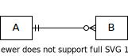
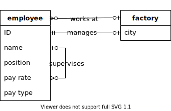
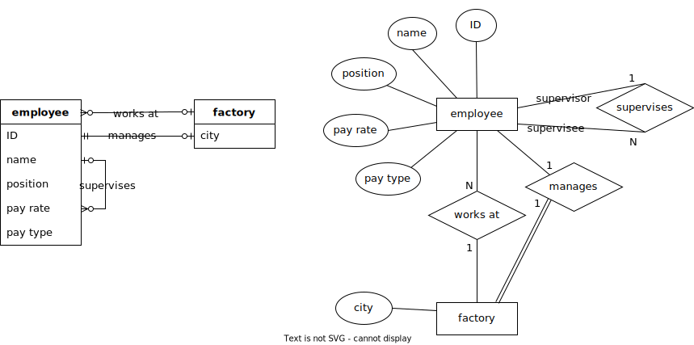
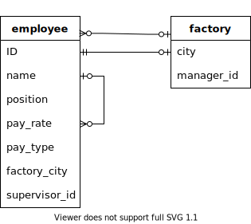
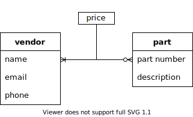
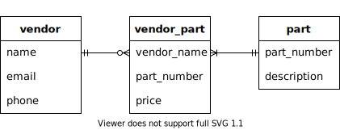

.. _other-notations-chapter:

===============================
ERD alternatives and variations
===============================

In this chapter we explore alternatives to Chen notation entity-relationship data modeling and other variations.  We start with *crow's foot* notation, a popular notation for entity-relationship modeling.  We show how the basic crow's foot notation can be used to model relational databases at lower levels of abstraction.  We finish with an overview of some of the more common variations you are likely to encounter in both Chen and crow's foot notation.  The examples used throughout correspond to the computer manufacturer data model developed in :numref:`Chapter {number} <erd-chapter>`.

Crow's foot notation
::::::::::::::::::::

"Crow's foot" is the nickname given to a family of modeling notations that originate in a :ref:`paper by Gordon Everest <data-modeling-references>` in 1976.  The notation has been widely adopted, expanded, and modified since.  The name comes from the symbol used to represent the "many" cardinality in relationships, which resembles a crow's foot (Everest originally called the symbol an "inverted arrow", and later "fork").

Entity-relationship modeling
----------------------------

In crow's foot notation, entities are represented with simple rectangles.  Entities can be labeled simply with a name for a higher level of abstraction, or they can contain a name and a list of attributes.  Key attributes can be indicated in various ways; we will style keys with bold type and underlining.  In our example data model, we have an entity modeling data regarding employees of our fictional computer manufacturer:

Relationships are represented with lines connecting entities.  Cardinality ratios are specified with different line ending symbols.  The possible cardinalities are:

======================================== ============
.. image:: crows_foot_zero_or_one.svg    Zero or one
.. image:: crows_foot_one_exactly.svg    One exactly
.. image:: crows_foot_zero_or_more.svg   Zero or more
.. image:: crows_foot_one_or_more.svg    One or more
======================================== ============

These cardinality symbols have two parts.  The symbol closest to the entity indicates the maximum cardinality - either *one* (represented by a vertical line) or *many* (represented by the branching "crow's foot").  The symbol further from the entity indicates minimum cardinality - either *zero* (represented by the open circle) or *one*.  A minimum cardinality of one is sometimes stated in terms of the entity being *mandatory*, while a minimum cardinality of zero indicates an *optional* entity.

Consider the relationship pictured below:

This diagram tells us that an instance of the **A** entity can be associated with zero or more instances of **B**.  An instance of **B** must be associated with exactly one instance of **A**.

Relationships may be further annotated with text to name or describe the relationship.

In our example data model, the **employee** entity participates in several relationships with itself and the **factory** entity:

The basic crow's foot notation can be extended to encompass the same advanced elements as Chen's notation, such as composite, derived, and multivalued attributes, weak entities and partial keys, relationship attributes, and higher arity relationships.  Different drawing and modeling tools may or may not provide direct support for these, and notations vary widely.

Some database designers prefer crow's foot notation over Chen's notation for entity-relationship modeling, in part due to its relatively compact form.  We can compare the above diagram side-by-side with its equivalent in Chen notation:

Ultimately which notation you use will depend on your preferences and the preferences of the people you are working with on a given project.

Lower level models
------------------

We have so far been discussing data modeling at an abstract level, which we might call the *conceptual* level.  At the conceptual level, the emphasis is on the fundamental data entities and their relationships, rather than the relational database constructs necessary to implement them.  For example, in conceptual modeling we typically do not include depictions of cross-reference tables, which are necessary in the implementation of many-to-many relationships, but which do not themselves represent entities of interest.  We might say that the conceptual model is focused on the *data* rather than the *database*.

At the next level of abstraction lives the *logical* model, which includes all of the relational database structure that results from applying the techniques described in :numref:`Chapter {number} <erd-to-relational-chapter>`.  Crow's foot notation is well suited to modeling at this level.

Below we show the conceptual and logical versions of two parts of our example data model.  Rectangles in the logical model now represent actual tables, and list all columns in the table.  We show columns participating in primary keys in boldface and underlined; foreign key columns are italicized.  Logical models often include data types, but we have omitted those details for now.

    A conceptual model showing entities **employee** and **factory**, and their relationships.

    The logical model constructed from the above conceptual model.  Note the addition of foreign key columns in both tables.

    A conceptual model showing entities **part** and **vendor**, and the many-to-many relationship between them.  The relationship has an attribute, which we have shown as a rectangle connected to the relationship line.

    The logical model constructed from the above conceptual model.  The many-to-many relationship has been realized as a cross-reference table.

If we choose, we can add even more detail to create a *physical* model.  The physical model would definitely include data types as well as any constraints on columns or tables, and might include details such as indexes or even where a table lives on disk or on the network.

Each level of abstraction has value, but whether or not you create models at a particular level will depend on your needs.  As discussed in :numref:`Chapter {number} <erd-chapter>`, models at the highest levels of abstraction are particularly valuable in the early stages of developing a database, and in communicating with all of the various stakeholders in a project.  The conceptual model can be used to produce a database directly, or you may prefer to create a logical model as an intermediate stage.  On the other hand, for some projects you may skip the conceptual level and start with a logical model.  It can be very useful to maintain a logical model documenting a database; with large and complex databases, even regular users of the database can forget the names of tables and columns!  Physical models are mostly used by database administrators (DBAs) on very complex projects, and are usually created in software tools that can also generate the SQL code to create the database.

Notational variations
:::::::::::::::::::::

- alternate cardinality notations
- alternate participation notations
- key notations
- other extensions (not covered) such as EER

.. |chapter-end| unicode:: U+274F

|chapter-end|

.. raw:: html

   

   
    <i>A Practical Introduction to Databases</i> by
   
   Christopher Painter-Wakefield is licensed under a
   <a rel="license" href="http://creativecommons.org/licenses/by-nc-sa/4.0/" target="_blank">
   Creative Commons Attribution-NonCommercial-ShareAlike 4.0 International License</a>.

