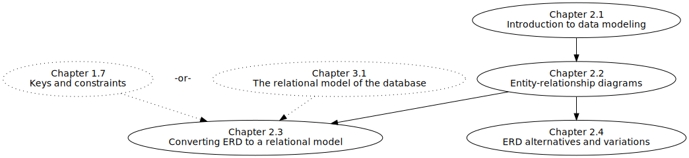

.. _data-modeling-part:

=============
DATA MODELING
=============

Part 2 of this book concerns graphical modeling in general, and entity-relationship diagrams in particular.  The diagram below shows the strong dependencies between chapters; chapters will assume knowledge introduced in earlier chapters as implied by the graph.  The dotted outlines indicate chapters from other sections of the book.

    Chapter dependency graph for Part 2

**Table of contents for Part 2**

.. toctree::
    :maxdepth: 3

    01-introduction/introduction
    02-ERD/ERD
    03-ERD-to-relational/ERD-to-relational
    04-other-notations/other-notations
