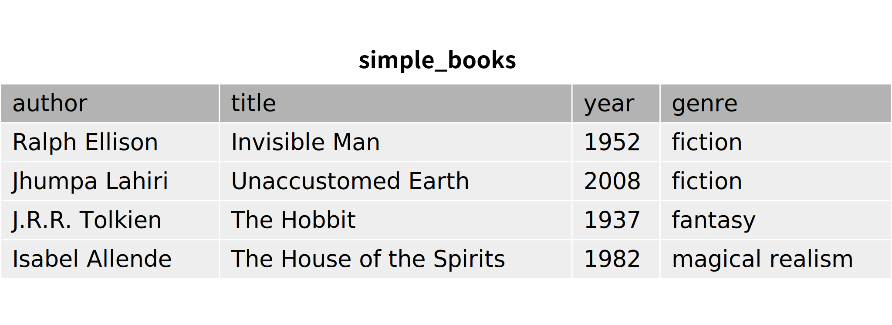
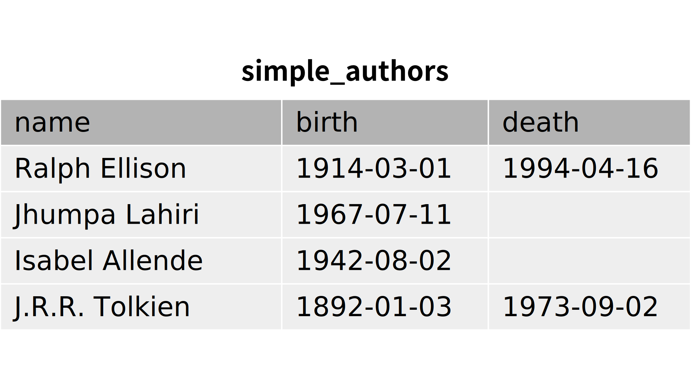
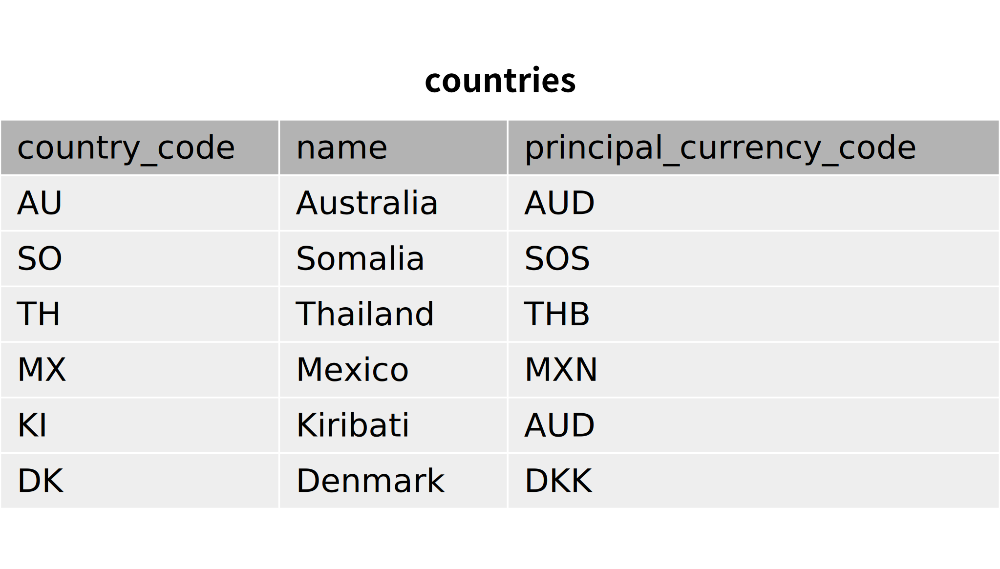

.. _relational-model-chapter:

====================================
The relational model of the database
====================================

In this chapter we introduce the mathematical model that relational databases are based on.  The *relational model* of the database provides a mathematical foundation for describing and reasoning about databases.  While most relational database systems in practice vary in small ways from the mathematical model (see :numref:`Chapter {number} <sql-vs-theory-chapter>`), understanding the model facilitates a deeper understanding of these systems.  Relational database theory is also important for understanding and ensuring good database design, as we will see in :numref:`Chapter {number} <normalization-chapter>`.

Given its mathematical foundations, the relational model is most conveniently expressed using at least some mathematical notation and terminology.  In the interests of keeping this book accessible to as wide an audience as possible, however, we will give the basics of the model using a minimum of notation and explain terms as we use them.

Model basics
::::::::::::

We start with a working definition of *set*, a mathematical object that we will use in defining other terms.  We then define *relations*, the fundamental objects of the relational model, and related terms.

Sets
----

A set is a mathematical object that represents a collection of distinct values.  Sets can be defined by some property that values have in common, or simply by listing all of the values in the set.  For some arbitrary value and some set, we can ask whether the value is a *member* of the set, that is, whether it is one of the values in the set.  For example, 2 is a member of the set of all numbers (an infinite set) and also a member of the set {1, 2, 3, 4} (a finite set containing four values).  On the other hand, 2 is not a member of the set of odd integers or the set of words describing colors (i.e., {blue, yellow, ...}).

Relations
---------

In the relational model, data exists in relations.  A relation is often depicted as a tabular data structure:

.. image:: books.svg
    :alt: A tabular illustration of a relation named simple_books, showing a header with attribute names and several rows of data, or tuples.

This illustration is just one possible way of depicting the relation **simple_books**, and tables (or two-dimensional arrays) are just one data structure that can be used for storing relations.  From the perspective of the relational model, relations are mathematical objects, not data structures.

Formally, a relation is a set of *tuples* that share the same *domain*.

Tuples
------

A tuple in the relational model is defined in two different ways; which is used depends on which is more convenient in a particular context.  We will start with the normal mathematical definition of a tuple as an ordered list of values.  A single value in the tuple is also called an *element* of the tuple.  We denote tuples as a comma-separated list within parentheses.  Tuples correspond to rows in the table above.  For example, one tuple from the **simple_books** relation could be written as:

    (*The House of the Spirits*, Isabel Allende, 1982, magical realism)

Each element of a tuple belongs to some set, which we call the *domain* of the element.  In our example tuple, the first element belongs to the domain of book titles.  The domain of the tuple is defined in terms of the domains of each value in the tuple.  Tuples of the **simple_books** relation belong to the domain of tuples with four elements for which the first element belongs to the domain of book titles, the second element the domain of authors, the third element the domain of calendar years, and the fourth element the domain of literary genres.

Attributes
----------

In an alternate definition of tuple, we can speak of the *attributes* of the tuple.  We can think of attributes as the named properties of the value represented by the tuple.  For example, if a tuple in the **simple_books** relation represents one book, then one attribute of the tuple is the book's **title**.  In our example tuple, the **title** attribute is *The House of the Spirits*.  The other attributes of books in our relation are **author**,  **year**, and **genre**.  In the table illustration above, the attribute names are shown in the header row.

In this definition of tuple, tuples are not necessarily ordered lists; each value in the tuple is associated not with a position but with an attribute.  Each attribute is associated with a domain; for example, the **title** attribute for any tuple in **simple_books** must be a member of the domain of book titles.  Having names associated with values in a tuple is much more convenient than having to refer to the *n*-th element when we want to query our database.

The two definitions of tuple are not exclusive.  In the first definition of tuple, each position in the ordered collection also corresponds to a specific attribute - in our example, the first element is the **title** attribute.  While we can think of tuples as having named attributes in no particular order, in practice we typically assign an ordering to the attributes in a relation - both definitions of tuple are used simultaneously.

Schemas
-------

A relation's attributes and domains are defined by its *schema*.  A relation (a set of tuples) is considered to be an *instance* of the relation schema if it conforms to the definition given by the schema; that is, if all of the tuples in the relation have the named attributes defined by the schema, and the attribute values are members of the correct domains.  In some definitions, relation schemas also include constraints which relations must conform to, such as *key* constraints, discussed below.

In a typical database, each relation schema is paired with exactly one relation, which is the current relation for the schema.  When a modification is made to the data in the current relation, it produces a new current relation.  Except in some specialized types of databases, there is no history of past relations associated with a relation schema.  Thus it is frequent practice to use the same name for the relation and its schema.

A *database* may be defined as a collection of relation schemas and their associated current relations.  The collection of relation schemas is called the database schema.

Uniqueness and permutations
:::::::::::::::::::::::::::

Relations, as sets of tuples, share certain important properties of sets.  First, items in a set must be distinct.  In the relational model, tuples must likewise be distinct, that is, no two tuples can have the same values for every attribute.  For our **simple_books** relation, it is entirely reasonable to suppose that we will add books that have the same author as some other tuple, or books published in the same year as another book.  However, we are forbidden to add a tuple that duplicates an existing tuple.

Another property (or perhaps lack of property) of sets is that there is no defined order of elements in a set.  An element of a set has no rank or position within the set.  Relations likewise have no intrinsic ordering of tuples.

When we provided a tabular illustration of the **simple_books** relation above, we noted that it was just one possible depiction of the relation.  We can, for example, permute the rows of the table, without changing the relation.  If we apply the second definition of tuple above, in which values are likewise not ordered but rather associated with specific attributes, it is valid to permute columns as well.  We would say, then, that the illustration of **simple_books** below is equivalent to our previous illustration:

Constraints
:::::::::::

*Constraints* are statements about relations which are required to be true at all times.  Some constraints are implicit in the definitions above; for example, the attribute values in a tuple are constrained to be members of the associated domain.  The relational model also incorporates two types of explicit constraint: keys and foreign keys.

Keys and primary keys
---------------------

In many cases, relations may contain subsets of attributes which uniquely identify tuples.  For example, for our **simple_books** relation, we will assert that the pair of attributes **author** and **title** uniquely identify any book in our relation, or any book we might choose to add to our relation in the future.  On the other hand, neither **author** nor **title** are sufficient on their own to uniquely identify a book - it is possible for two different authors to create books with the same name, and of course, many books may have the same author.  In the relational model, we state that the set {**author**, **title**} is a *key* for the **simple_books** relation.

Keys play an important part in relational theory, as we will see.  One implication that we will explore further in a later chapter is that no two tuples in our **simple_books** relation (now or ever) can share the exact same **author** and **title** values.  In fact, the assertion that no two tuples can share the same **author** and **title** in return implies that **author** and **title** together uniquely identify any book.  The assertions are equivalent.

It is important to emphasize that the key property is a fact we are stating about the world, not a transitory property of the data in a relation.  For example, our current **simple_books** illustration shows no duplicate values for **year**.  For **year** to be a key, though, requires that **year** never contain duplicates *for any collection of books* we might store in the **simple_books** relation.  Since many books are published every year, we should expect **year** to accumulate duplicate values if we add books to the relation.

Relations may have more than one key.  A common example is that of a table of employees for a company.  In many countries, workers must have a government issued identification (ID) number.  These numbers can be used to uniquely identify an employee.  However, these numbers are often considered sensitive employee data, which should only be shared with certain trusted individuals in the company.  In these cases, companies will generate an internal employee ID number, which is completely independent of the government issued ID.  The company's database will contain both of these unique identifiers.

The keys of a relation are also known as *candidate keys*.  One candidate key is chosen as the *primary key* for the relation.  The remaining keys are sometimes called *unique keys*.

In the relational model, all keys are constrained to be unique.  If a set of tuples contains duplicate values for some key according to some relation schema (e.g., the same **author** and **title** per the **simple_books** schema), we do not consider that a valid relation of the schema.

Foreign keys
------------

Relational databases do not explicitly store connections between related records.  Instead, we must store values in one relation which we can use to "look up" related values in another relation.  In a properly designed relational database, we will nearly always store values from the primary key of the related relation.  The attribute or group of attributes storing the key from the other relation is called a *foreign key*.

Consider the relation **simple_authors** represented below:

Our primary key for this relation is the **name** attribute.  Names are generally not a very good choice for keys, as people often share a name with other people, but this is just a simple illustration and not intended to be an example of good database design.

Because every **author** value in **simple_books** matches some **name** value in **simple_authors**, we can connect each book to information about its author.  To assert that it should always be true that any tuple in **simple_books** matches a tuple in **simple_authors**, we declare the **author** attribute of **simple_books** to be a foreign key *referencing* the **name** attribute of **simple_authors**.  This foreign key constraint, also known as a *referential integrity* constraint, applies not only to the current relations, but to any future states of **simple_books** and **simple_authors**.

Note that the foreign key is a constraint on both relations; certain changes in either relation could result in a constraint violation.  The constraint is not symmetric, however; we can have authors listed in **simple_authors** for whom no books are listed in **simple_books**.

Consistency
-----------

A database in which constraints are violated is considered *inconsistent*.  A relational database system is expected to enforce consistency and prevent any data modification operations which would violate constraints.  Consistency helps ensure that we get good answers from our queries, or at least helps us avoid certain common problems.  For example, guaranteeing unique ID values in an employee relation prevents potential issues from confusing two employees, such as issuing two paychecks to the same person (and none to another person).  Foreign key constraints can prevent meaningless results when data in one relation refers to non-existent data in another relation.

Modification operations
:::::::::::::::::::::::

The relational model assumes that a relation may be modified with one of three operations: tuples may be added (inserted) into the relation, values within tuples may be modified (updated) without adding or removing the tuple, or tuples may be removed (deleted) from the relation.  The state of the database must be consistent with all constraints after modification, or the operation must be rejected by the database system.  In certain cases (such as the existence of a circular foreign key relationship), it may be necessary to group multiple modifications together with a *transaction*; constraints may be temporarily violated within the context of the transaction, but must be resolved when all operations have been completed, or none of the operations may take effect.  (We discuss transactions as commonly implemented in :numref:`Chapter {number} <transactions-chapter>`.)

Insertion operations can violate primary and unique key constraints on a relation, if the tuple being inserted contains values that duplicate values already in the relation.  Insertion operations can also violate foreign key constraints on a relation, if a value is provided for a foreign key attribute that does not exist in the referenced table.  For example, each of the tuples below would violate constraints if added to the **simple_books** relation (assuming the primary and foreign keys discussed in the text above):

    (*The House of the Spirits*, Isabel Allende, 1999, history)

    (*A Wizard of Earthsea*, Ursula K. Le Guin, 1968, fantasy)

In the first case, this author and title already exists in the **simple_books** relation.  In the second case, the author is not present in the **simple_authors** relation.

Deletions, on the other hand, can never violate primary or unique key constraints.  A deletion in one relation can violate a foreign key constraint, however, if a foreign key value in another relation references the deleted key being deleted.  For example, we may not delete from **simple_authors** the tuple:

    (Ralph Ellison, 1914-03-01, 1994-04-16)

This author has a book in the **simple_books** table.

Updates can create any of the constraint violations described above.  For example, an update which changes the value of a primary key must not change the value such that it would duplicate another tuple's primary key.  Similarly, if a foreign key value in another relation depends on the primary key value being updated, then the update cannot proceed.  Finally, an update may not change a foreign key value to something which is not in the referenced table.

NULL
::::

In the **simple_authors** relation shown earlier, two of the entries show no value for the attribute **death**, which is because those two authors are still living.  If we consider the domain of the **death** attribute to be the domain of calendar dates, then there is truly no value we can choose that accurately represents the situation.  Instead, we are using a special placeholder to represent the *absence of information*.  In the relational model, that placeholder is called *NULL*.

The nature of NULL, and in fact, its very presence in the relational model, is controversial.  Some database scholars treat NULL as a special value that is included with every domain.  So we can say that we have put a NULL value in our table for the death attribute for each living author.  However, NULL exhibits special properties that make it problematic as a value, such as the fact that it cannot be compared with other values, including other NULLs - more on this in a bit.  For this reason, other scholars prefer to treat NULL as a special *state* of the attribute; we can say that **death** is in a null state when the author is living.  Finally, some scholars reject NULL entirely as fundamentally incompatible with relational theory.

The problem NULL was created to solve is the problem of missing information.  Information may be unknown for many reasons: it may be that nobody knows the true value, or it may have been simply overlooked when entering data into the database, or any number of other causes.  Data may be irrelevant or inapplicable, as in the example of the **death** date for living authors.  Researchers have identified many different meanings that can be ascribed to NULL, which has led some scholars to propose additional placeholders instead of just one (although some of those proposals were intended to highlight the problems with NULL, rather than improve the model).  The problem is, the definition of a tuple requires there to be *something* associated with every attribute defined in the relation schema; even if nothing from the domain is appropriate, the tuple cannot simply be incomplete.

While there are alternatives to the use of NULL, the alternatives are problematic in their own ways.  Most database systems based on the relational model implement support for NULL.  For these reasons, NULL is an important part of our discussion of the relational model.

Three-valued logic
------------------

Many operations on relations make use of Boolean logic and the usual operations on logical expressions.  There are only two values in Boolean logic: *true* and *false*.  The basic Boolean operators are easy to understand and apply.  The NOT operation simply inverts the Boolean value: "NOT true" equals false, and "NOT false" equals true [#]_.  Given two Boolean values, *a* and *b*, the expression "a AND b" yields true if and only if *a* is true and *b* is true.  On the other hand, the expression "a OR b" is true if *a* or *b* is true, and is false only if both *a* and *b* are false.

However, when NULL is used in most expressions, it is unknown whether the answer is true or false.  For example, the expression "2 = x", where *x* is assigned NULL (or is in the null state, if you prefer) cannot be determined to be true or false.  The problem is that NULL is not a distinct value of its own, but represents the absence of information altogether.  Thus, we *do not know* if *x* equals 2 or something else.  Even the expression "x = y", where both *x* and *y* are NULL cannot be determined to be true or false!

The solution is to enhance Boolean logic with a third value, *unknown*, giving a *three-valued logic*.  With so many combinations, it is easiest to summarize the results of AND, OR, and NOT operations with the following tables:

======== ======== =========== ==========
*a*      *b*      *a* AND *b* *a* OR *b*
======== ======== =========== ==========
true     true     true        true
true     false    false       true
true     unknown  unknown     true
false    true     false       true
false    false    false       false
false    unknown  false       unknown
unknown  true     unknown     true
unknown  false    false       unknown
unknown  unknown  unknown     unknown
======== ======== =========== ==========

======== =======
*a*      NOT *a*
======== =======
true     false
false    true
unknown  unknown
======== =======

It is not necessary to memorize these tables, if some common sense is applied.  Consider the expression "a OR b", and let *b* be unknown.  To determine the result of "a OR b", we simply need to consider whether or not we have enough information without knowing the value of *b*.  In fact, if *a* is true, it does not matter if *b* is true or false - the result "a OR b" is true.  Thus "true OR unknown" equals true.  On the other hand, if *a* is false, then it really does matter whether *b* is true or false; since we don't know, the result "a OR b" is unknown.  A similar thought process can be applied to the other operations.

Constraints and NULL
--------------------

With NULL in our model, we must make some small adjustments to our rules regarding constraints.  First, we must further constrain primary key attributes to never be NULL.  Remember that a primary key should be an identifier for tuples in a relation, and every tuple must have a unique primary key value.  However, if NULL is present in any primary key attribute for some tuple, it is impossible to search for and find the tuple - any attempt to compare the primary key with a lookup value gives an unknown result.  We likewise cannot properly enforce uniqueness, because we cannot compare a tuple with NULL in the primary key with other tuples to determine if they are distinct from one another.

Second, we modify the rule for a foreign key.  The new rule is that a foreign key may be NULL, otherwise it must match a value in the referenced table.  Allowing NULL in a foreign key may seem surprising, but considering our example relations, how might we handle a book for whom the author is unknown (anonymous)?  If NULL is not allowed for the author, then we cannot add the book to **simple_books** without some matching record in the **simple_authors** table.  However, what is the meaning of a record in the **simple_authors** table for an unknown author?  (Note also we cannot have a NULL name for the author in **simple_authors** due to the primary key.)  While there are multiple ways to approach this problem, allowing NULL for the author is one possible solution.

Self-check exercises
::::::::::::::::::::

This section has some questions you can use to check your understanding of the relational model of the database.

.. dragndrop:: relational_model_self_test_definitions
    :match_1: set|||A collection of distinct values
    :match_2: relation|||A set of tuples from the same domain
    :match_3: attribute|||A named property of a tuple
    :match_4: domain|||A set of values which attribute values belong to
    :match_5: relation schema|||A definition of the attributes and domains of a relation

    Drag the term to its matching definition.

.. mchoice:: relational_model_self_test_tuples

    What is the definition of *tuple* as used in the relational model?

    -   An ordered collection of values; each position in the tuple is associated with a domain.

        - This is one definition.

    -   A set of values associated with a named attribute; each attribute is associated with a domain.

        - This is one definition.

    -   Either or both of the above definitions may be used, depending on the context.

        + Correct.

.. mchoice:: relational_model_self_test_relation_properties

    Which of these best describes a relation?

    -   A collection of tuples in order by primary key value.  Each tuple must be unique and have the same number and types of attributes.

        - Relations have no intrinsic ordering.

    -   A collection of tuples in no particular order.  Each tuple must be unique and have the same number and types of attributes.

        + Correct.

    -   A collection of tuples in no particular order, possibly with duplicates.  Each tuple must have the same number and types of attributes.

        - Tuples in a relation must be distinct, that is, there cannot be duplicate tuples.

    -   A collection of tuples in no particular order.  Each tuple must be unique.  Each tuple has its own attributes, which may differ from tuple to tuple.

        - Tuples in a relation must come from the same domain of tuples; that is, each tuple shares the same definition in terms of attributes and associated domains.

The next four questions concern the two relations pictured below, which map ISO (International Organization for Standardization) country codes to country names and ISO currency codes, and currency codes to the name of the currency.  The primary key for **countries** is **country_code**, and the primary key for **currencies** is **currency_code**.  The **principal_currency_code** column in **countries** is a foreign referencing **currency_code** in **currencies**.  Obviously this represents a subset of available data, for space reasons.

.. mchoice:: relational_model_self_test_constraints_1

    What constraint or constraints would be violated if we insert the tuple (DK, Danmark, DKK) into the **countries** relation?

    -   Primary key on the **countries** relation.

        + Correct.

    -   Primary key on the **countries** relation and the foreign key constraint on **principal_currency_code**.

        - DKK is a currency code in the **currencies** relation.

    -   Foreign key constraint on **principal_currency_code**.

        - DKK is a currency code in the **currencies** relation.

    -   No constraints would be violated.

        - Incorrect.

.. mchoice:: relational_model_self_test_constraints_2

    What constraint or constraints would be violated if we delete the tuple (AU, Australia, AUD) from the **countries** relation?

    -   Primary key on the **countries** relation.

        - No, the **country_code** column will still contain unique, non-null entries.

    -   Primary key on the **countries** relation and the foreign key constraint on **principal_currency_code**.

        - No, the **country_code** column will still contain unique, non-null entries, and all **principal_currency_code** values still match values in the **currencies** relation.

    -   Foreign key constraint on **principal_currency_code**.

        - No, all **principal_currency_code** values still match values in the **currencies** relation.

    -   No constraints would be violated.

        + Correct.

.. mchoice:: relational_model_self_test_constraints_3

    What constraint or constraints would be violated if we delete the tuple (THB, Baht) from the **currencies** relation?

    -   Primary key on the **currencies** relation.

        - No, the **currency_code** column will still contain unique, non-null entries.

    -   Primary key on the **currencies** relation and the foreign key constraint on **principal_currency_code**.

        - No, the **currency_code** column will still contain unique, non-null entries.

    -   Foreign key constraint on **principal_currency_code**.

        + Correct.  The entry for Thailand in **countries** will have a **principal_currency_code** that is not matched by anything in the **currencies** relation.

    -   No constraints would be violated.

        - Incorrect.

.. mchoice:: relational_model_self_test_constraints_4

    What constraint or constraints would be violated if we insert the tuple (ARS, Argentine Peso) into the **currencies** relation?

    -   Primary key on the **currencies** relation.

        - No, ARS is distinct from the currency codes previously in the table.

    -   Primary key on the **currencies** relation and the foreign key constraint on **principal_currency_code**.

        - No, ARS is distinct from the currency codes previously in the table, and the foreign key constrains **principal_currency_code** values to be in the **currency_code** column of **currencies**, but not vice-versa.

    -   Foreign key constraint on **principal_currency_code**.

        - No, the foreign key constrains **principal_currency_code** values to be in the **currency_code** column of **currencies**, but not vice-versa.

    -   No constraints would be violated.

        + Correct.

.. mchoice:: relational_model_self_test_constraints_5

    What constraint or constraints would be violated if we insert the tuple (AQ, Antarctica, NULL) into the **countries** relation?  (Yes, Antarctica is technically not a country, but they do have an ISO country code.)

    -   Primary key on the **countries** relation.

        - No, AQ is distinct from the country codes previously in the table.

    -   Primary key on the **countries** relation and the foreign key constraint on **principal_currency_code**.

        - No, AQ is distinct from the country codes previously in the table.  The **principal_currency_code** value is NULL, which is allowed under the definition of a foreign key.

    -   Foreign key constraint on **principal_currency_code**.

        - No, the **principal_currency_code** value is NULL, which is allowed under the definition of a foreign key.

    -   No constraints would be violated.

        + Correct.

.. mchoice:: relational_model_self_test_constraints_6

    What constraint or constraints would be violated if we modify the tuple (AUD, Australian Dollar) in **currencies** to be (DKK, Australian Dollar)?

    -   Primary key on the **currencies** relation.

        - True, but might another constraint be violated?

    -   Primary key on the **currencies** relation and the foreign key constraint on **principal_currency_code**.

        + Correct.  DKK duplicates an existing currency code in **currencies**, and the change would also remove AUD from the list of currencies, which is referenced by two rows in **countries**.

    -   Foreign key constraint on **principal_currency_code**.

        - True, but might another constraint be violated?

    -   No constraints would be violated.

        - Incorrect.

.. dragndrop:: relational_model_self_test_three_value_logic_2
    :match_1: true AND unknown|||unknown
    :match_2: true OR unknown|||true
    :match_3: false AND true|||false

    Drag the expression to the outcome of its evaluation.

.. dragndrop:: relational_model_self_test_three_value_logic_1
    :match_1: NOT false|||true
    :match_2: unknown AND false|||false
    :match_3: false OR unknown|||unknown

    Drag the expression to the outcome of its evaluation.

|chapter-end|

----

**Notes**

.. [#] There are many notations for Boolean logic operators.  For simplicity, we will simply use NOT, AND, and OR instead of more compact notation.

|license-notice|
