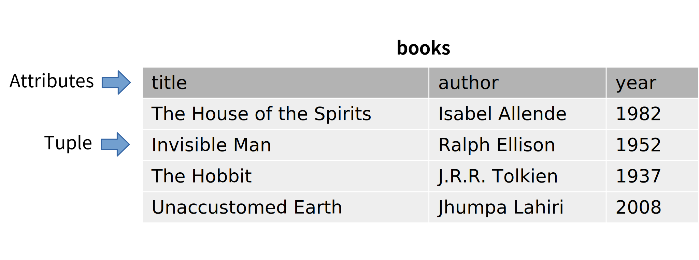

.. _relational-model-chapter:

====================================
The relational model of the database
====================================

In this chapter we introduce the mathematical model that relational databases are based on.  The *relational model* of the database provides a mathematical foundation for describing and reasoning about databases.  While most relational database systems in practice vary in small ways from the mathematical model (see :numref:`Chapter {number} <sql-vs-theory-chapter>`), understanding the model facilitates a deeper understanding of these systems.  Relational database theory is also important for understanding and ensuring good database design, as we will see in :numref:`Chapter {number} <normalization-chapter>`.

Given its mathematical foundations, the relational model is most conveniently expressed using at least some mathematical notation and terminology.  In the interests of keeping this book accessible to as wide an audience as possible, however, we will give the basics of the model using a minimum of notation and explain terms as we use them.  For those interested, a more formal mathematical treatment of the relational model is provided at the end of the chapter.

Definitions
:::::::::::

We start with a working definition of *set*, a mathematical object that we will use in defining other terms.  We then define *relations*, the fundamental objects of the relational model, and related terms.

Sets
----

A set is a mathematical object that represents a collection of distinct values.  Sets can be defined by some property that values have in common, or simply by listing all of the values in the set.  For some arbitrary value and some set, we can ask whether the value is a *member* of the set, that is, whether it is one of the values in the set.  For example, 2 is a member of the set of all numbers (an infinite set) and also a member of the set {1, 2, 3, 4} (a finite set containing four values).  On the other hand, 2 is not a member of the set of odd integers or the set of words describing colors (i.e., {blue, yellow, ...}).

Relations
---------

In the relational model, data exists in relations.  A relation is often depicted as a tabular data structure:

This illustration is just one possible way of depicting the relation **books**, and tables (or two-dimensional arrays) are just one data structure that can be used for storing relations.  From the perspective of the relational model, relations are mathematical objects, not data structures.

Formally, a relation is a set of *tuples* that share the same *domain*.

Tuples
------

A tuple in the relational model is defined in two different ways; which is used depends on which is more convenient in a particular context.  We will start with the normal mathematical definition of a tuple as an ordered list of values.  A single value in the tuple is also called an *element* of the tuple.  We denote tuples as a comma-separated list within parentheses.  Tuples correspond to rows in the table above.  For example, one tuple from the **books** relation could be written as:

    (*The House of the Spirits*, Isabel Allende, 1982)

Each element of a tuple belongs to some set, which we call the *domain* of the element.  In our example tuple, the first element belongs to the domain of  book titles.  The domain of the tuple is defined in terms of the domains of each value in the tuple.  Tuples of the **books** relation belong to the domain of tuples with three elements for which the first element belongs to the domain of book titles, the second element the domain of authors, and the third element the domain of calendar years.

Attributes
----------

In an alternate definition of tuple, we can speak of the *attributes* of the tuple.  We can think of attributes as the named properties of the value represented by the tuple.  For example, if a tuple in the **books** relation represents one book, then one attribute of the tuple is the book's **title**.  In our example tuple, the **title** attribute is *The House of the Spirits*.  The other attributes of books in our relation are **author** and **year**.  In the table illustration above, the attribute names are shown in the header row.

In this definition of tuple, tuples are not necessarily ordered lists; each value in the tuple is associated not with a position but with an attribute.  Each attribute is associated with a domain; for example, the **title** attribute for any tuple in **books** must be a member of the domain of book titles.  Having names associated with values in a tuple is much more convenient than having to refer to the *n*-th element when we want to query our database.

The two definitions of tuple are not exclusive.  In the first definition of tuple, each position in the ordered collection also corresponds to a specific attribute - in our example, the first element is the **title** attribute.  While we can think of tuples as having named attributes in no particular order, in practice we typically assign an ordering to the attributes in a relation.

Schemas
-------

A relation's attributes and domains are defined by its *schema*.  A relation (a set of tuples) is considered to be an *instance* of the relation schema if it conforms to the definition given by the schema; that is, if all of the tuples in the relation have the named attributes defined by the schema, and the attribute values are members of the correct domains.  In some definitions, relation schemas also include constraints which relations must conform to, such as *key* constraints, discussed below.

In a typical database, each relation schema is paired with exactly one relation, which is the current relation for the schema.  When a modification is made to the data in the current relation, it produces a new current relation.  Except in some specialized types of databases, there is no history of past relations associated with a relation schema.  Thus it is frequent practice to use the same name for the relation and its schema.

A *database* may be defined as a collection of relation schemas and their associated current relations.  The collection of relation schemas is called the database schema.

- definitions
  - relation
  - tuple
  - attribute
  - relation schema
  - relational database schema
- properties
  - implications of relation as a set (ordering, duplicates)
  - named attributes vs positional
- interpretation as "facts", closed world
- key, superkey
- foreign key
- null
- preview of algebra operations

.. |chapter-end| unicode:: U+274F

|chapter-end|

.. raw:: html

   

   
    <i>A Practical Introduction to Databases</i> by
   
   Christopher Painter-Wakefield is licensed under a
   <a rel="license" href="http://creativecommons.org/licenses/by-nc-sa/4.0/" target="_blank">
   Creative Commons Attribution-NonCommercial-ShareAlike 4.0 International License</a>.

