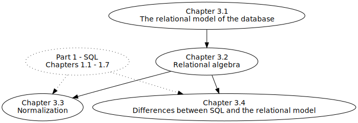

.. _relational-theory-part:

==========================
RELATIONAL DATABASE THEORY
==========================

Part 3 of this book explains the mathematical and theoretical foundations of relational database technology.  The diagram below shows the strong dependencies between chapters.  The first three chapters need to be read in order; however, chapter 3.3 on database normalization should be accessible for students who have a strong foundation in relational databases through the lens of SQL (:numref:`Part {number} <sql-part>` of the text).

    Chapter dependency graph for Part 3

.. toctree::
    :maxdepth: 3

    01-relational-model/relational-model
    02-relational-algebra/relational-algebra
    03-normalization/normalization
    04-sql-vs-theory/sql-vs-theory

|license-notice|
