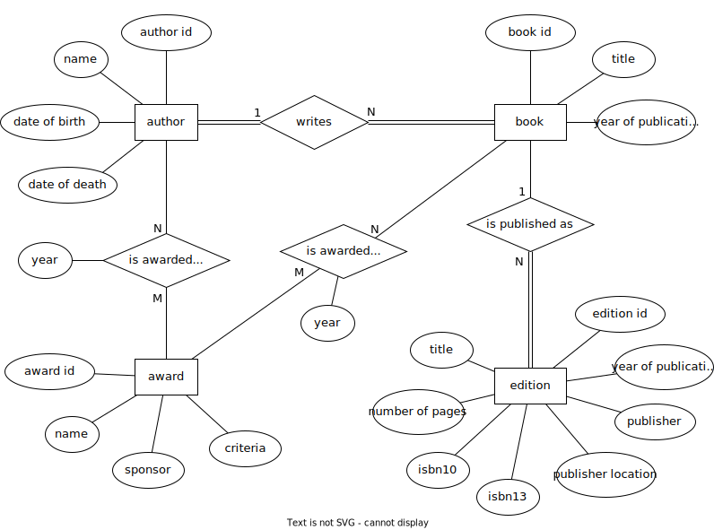
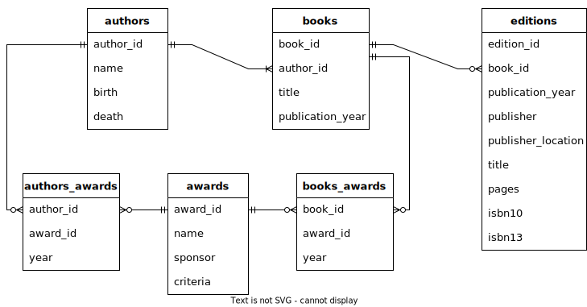

.. _appendix-a:

==============================================
Appendix A: Example datasets used in this book
==============================================

This appendix contains descriptions of the tables in the textbook database as well as SQL scripts and data files that can be used to recreate the book's database in other database systems.

.. contents:: Quick links
   :local:
   :depth: 2
   :backlinks: none

Dataset descriptions
::::::::::::::::::::

In this section we provide descriptions of each dataset or group of related tables.  The tables are described in detail in tabular format. Entity-relationship diagrams (ERDs) and logical models using crow's foot notation (as described in :numref:`Part {number} <data-modeling-part>`) are also provided for some datasets.  Finally, each dataset section contains an interactive query tool set up to retrieve the data from all of the tables in the dataset (note that the interactive query tool limits results to 100 rows, and some tables have more than that number of rows).

The simple books dataset
------------------------

The simple books dataset consists of the tables **simple_books** and **simple_authors**.  The **simple_books** table contains data about 12 books, each by a different author, while the **simple_authors** table contains data on each of the 12 authors appearing in **simple_books**.

This dataset is used in the early chapters of :numref:`Part {number} <sql-part>` of the text to introduce SQL, and is not intended as an example of good database design.  The rows in **simple_books** are implicitly identified by unique book titles, and the rows in **simple_authors** are implicitly identified by author names, but neither table has a primary key.  Similarly, the rows in **simple_books** are in one-to-one correspondence with the rows in **simple_authors**, however, there is no explicit relationship between the tables via a foreign key constraint.

.. container:: data-dictionary

    The **simple_books** table records works of fiction, non-fiction, poetry, etc. by a single author.

    ================ ================= ===================================
    column           type              description
    ================ ================= ===================================
    author           character string  the book's author
    title            character string  the book's title
    publication_year integer           year the book was first published
    genre            character string  a genre describing the book
    ================ ================= ===================================

.. container:: data-dictionary

    The **simple_authors** table records persons who have authored books.

    ========== ================= ===================================
    column     type              description
    ========== ================= ===================================
    name       character string  full name of the author
    birth      date              birth date of the author, if known
    death      date              death date of the author, if known
    ========== ================= ===================================

Use the query tool below to view the data.

.. activecode:: appendix_a_simple_books_dataset
    :language: sql
    :dburl: /_static/textbook.sqlite3

    SELECT * FROM simple_books;
    SELECT * FROM simple_authors;

To see the **CREATE TABLE** code for a table, you can use the query tool above to query the **sqlite_master** table, e.g.:

::

        SELECT sql FROM sqlite_master WHERE name = 'simple_books';

The expanded books dataset
--------------------------

The expanded books dataset includes information on 200 books (in the **books** table) and their authors (76 authors in total in the **authors** table).  An **awards** table lists some major awards given to authors for their body of work or for specific books.  Two cross-reference tables associate authors with their awards (**authors_awards**) and specific books with their awards (**books_awards**).  Finally, the **editions** table contains publication data related to just four books by author J.R.R. Tolkien.  (Only four books were included to reduce the size of the database file, which must be downloaded and held in the web browser's memory.)  The publication data is particularly "dirty" in the sense that it contains numerous inaccuracies, omissions, and redundancies; see the section title `Data collection notes`_, below.

This dataset is introduced in :numref:`Chapter {number} <joins-chapter>` and is used throughout much of the rest of :numref:`Part {number} <sql-part>` of the text.  While the dataset represents a highly simplified model of books (e.g., books are assumed to always have a single author), the schema attempts to emulate best practices in database design while illustrating fundamental SQL database concepts.  The design makes use of primary key constraints (using synthetic unique identifiers), foreign key constraints, and cross-reference tables implementing many-to-many relationships.

We provide below detailed descriptions of each table in the dataset, an entity-relationship diagram (ERD) modeling the data, and a logical model in crow's foot notation showing the tables and their relationships.

.. container:: data-dictionary

    The **authors** table records persons who have authored books.  Every author corresponds to at least one book in the database.

    ========== ================= ===================================
    column     type              description
    ========== ================= ===================================
    author_id  integer           unique identifier for the author
    name       character string  full name of the author
    birth      date              birth date of the author, if known
    death      date              death date of the author, if known
    ========== ================= ===================================

.. container:: data-dictionary

    The **books** table records works of fiction, non-fiction, poetry, etc. by a single author.  Each book corresponds to a single author from the **authors** table, and may correspond to many editions of the book listed in the **editions** table.

    ================ ================= =================================================
    column           type              description
    ================ ================= =================================================
    book_id          integer           unique identifier for the book
    author_id        integer           author_id of book's author from **authors** table
    title            character string  the book's title
    publication_year integer           year the book was first published
    ================ ================= =================================================

.. container:: data-dictionary

    The **editions** table records specific publications of a book.  Each edition corresponds to a single book from the **books** table.  For space reasons, the **editions** table only includes data on four books by J.R.R. Tolkien.

    ================== ================= ====================================================================
    column             type              description
    ================== ================= ====================================================================
    edition_id         integer           unique identifier for the edition
    book_id            integer           book_id of the book (from **books** table) published as this edition
    publication_year   integer           year this edition was published
    publisher          character string  name of the publisher
    publisher_location character string  city or other location(s) where the publisher is located
    title              character string  title this edition was published under
    pages              integer           number of pages in this edition
    isbn10             character string  10-digit international standard book number
    isbn13             character string  13-digit international standard book number
    ================== ================= ====================================================================

.. container:: data-dictionary

    The **awards** table records various author and/or book awards.

    ========= ================= =========================================
    column    type              description
    ========= ================= =========================================
    award_id  integer           unique identifier for the award
    name      character string  name of the award
    sponsor   character string  name of the organization giving the award
    criteria  character string  what the award is given for
    ========= ================= =========================================

.. container:: data-dictionary

    The **authors_awards** table is a *cross-reference* table (explained in :numref:`Chapter {number} <joins-chapter>`) relating **authors** and **awards**; each entry in the table records the giving of an award to an author (not for any particular book) in a particular year.

    =========== =========== ===========================================
    column      type        description
    =========== =========== ===========================================
    author_id   integer     author_id of the author receiving the award
    award_id    integer     award_id of the award received
    year        integer     year the award was given
    =========== =========== ===========================================

.. container:: data-dictionary

    The **books_awards** table is a cross-reference table relating **books** and **awards**; each entry in the table records the giving of an award to an author for a specific book in a particular year.

    =========== =========== =================================================
    column      type        description
    =========== =========== =================================================
    book_id     integer     book_id of the book for which the award was given
    award_id    integer     award_id of the award given
    year        integer     year the award was given
    =========== =========== =================================================

Here is the data model for the expanded books dataset, as an ERD:

A logical model of the expanded books dataset is shown below.  In this crow's foot diagram, primary keys are shown underlined and in boldface, while foreign keys are italicized.

Use the query tool below to view the expanded books data.  Note that the query tool limits results to 100 rows, but the **books** and **editions** tables have more than 100 rows each.

.. activecode:: appendix_a_expanded_books_dataset
    :language: sql
    :dburl: /_static/textbook.sqlite3

    SELECT * FROM authors;
    SELECT * FROM books;
    SELECT * FROM editions;
    SELECT * FROM awards;
    SELECT * FROM authors_awards;
    SELECT * FROM books_awards;

The bookstore dataset
---------------------

The bookstore dataset consists of the tables **bookstore_inventory** and **bookstore_sales**.  These tables simulate a very simple database that a seller of used books might use.  The **bookstore_inventory** table represents books that the bookseller is selling.  The table actually includes some books that have already been sold - when a book is sold, an entry is added to the companion table, **bookstore_sales**.  The bookseller thus has to look at both tables to determine which books are actually available to be sold.  The bookseller may choose to periodically remove old records from the tables.

While students should feel free to modify any data within the textbook database (secure in the knowledge that any changes will be reverted when they reload the page in their browser), the bookstore dataset was specifically designed with data modification in mind.  To avoid complications in introducing data modification queries, there are no foreign key constraints on the tables.  However, the tables as provided have a one-to-one relationship: each record in **bookstore_sales** matches exactly record in **bookstore_inventory**, while each record in **bookstore_inventory** matches at most one record in **bookstore_sales**.

This dataset is used briefly to illustrate one-to-one relationships in :numref:`Chapter {number} <joins-chapter>`.  In :numref:`Chapter {number} <data-modification-chapter>`, the tables are used to demonstrate data modification queries.  The tables are used in examples of grouping and aggregation in :numref:`Chapter {number} <grouping-chapter>`.

.. container:: data-dictionary

    The **bookstore_inventory** table contains information on new and used books for sale.

    ============= ================= ==================================================
    column        type              description
    ============= ================= ==================================================
    stock_number  integer           unique key identifying a particular copy of a book
    author        character string  the author of the book
    title         character string  the title of the book
    condition     character string  the condition of the book (new, good, fair, etc.)
    price         fixed-point       the price of the book, in some unit of currency
    ============= ================= ==================================================

.. container:: data-dictionary

    The **bookstore_sales** table gives information about the sales of books from **bookstore_inventory**.

    =============== ================= =================================================================
    column          type              description
    =============== ================= =================================================================
    receipt_number  integer           unique key identifying this sale
    stock_number    integer           key of the book copy (from **bookstore_inventory**) that was sold
    date_sold       date              the date on which the books was sold
    payment         character string  the method of payment used in the sale (case, credit card, etc.)
    =============== ================= =================================================================

Use the query tool below to view the data.

.. activecode:: appendix_a_bookstore_dataset
    :language: sql
    :dburl: /_static/textbook.sqlite3

    SELECT * FROM bookstore_inventory;
    SELECT * FROM bookstore_sales;

Other tables in the database
----------------------------

In addition to the above, the database contains some very small tables which are used to illustrate various points in the text: **fruit_stand**, **s**, **s2**, **s3**, **t**, **t2**, and **t3**.  As these tables are give in full in the text, we do not further explain them here.  However, you can use the interactive query tool below to view the data.

.. activecode:: appendix_a_miscellaneous_tables
    :language: sql
    :dburl: /_static/textbook.sqlite3

    SELECT * FROM fruit_stand;
    SELECT * FROM s;
    SELECT * FROM s2;
    SELECT * FROM s3;
    SELECT * FROM t;
    SELECT * FROM t2;
    SELECT * FROM t3;

Data collection notes
:::::::::::::::::::::

The selection of books in the simple and expanded books datasets was driven by several interests.  First, the textbook's author is a fan of science fiction and fantasy - these genres are thus perhaps overrepresented in the dataset.  Second, an attempt was made to include a diverse set of authors, in hopes of providing some common points of reference for students everywhere.  (There is nevertheless a strong bias towards English-language literature, reflecting the context of the textbook's author.) Lastly, the selection favored books by authors who have received literary awards.  To keep things manageable, the number of books was capped at 200.

Authors were handpicked, based on the textbook author's knowledge and on internet searches of major literary awards. `Wikipedia`_ was extremely helpful in collecting data such as authors' birth and death dates.  (Note that the dataset was finalized in 2022; it is very possible that some authors in the dataset have died since the data was entered.  This inaccuracy is regrettable but unavoidable under the circumstances.)

Some authors are represented by a single work (typically an award winning or at least widely acclaimed book), while in other cases many books by the author were included.  There was no consistent decision process used to decide how many books to include by each author.  Many choices were made in support of specific examples in the text.  Most of the data regarding individual books was hand collected from Wikipedia and other freely available sources on the internet.  Some publication year values were extracted from the freely available `Open Library`_ dataset.

Data on author and book awards was hand collected from Wikipedia and the websites representing the awards.  Data on the many editions of works comes entirely from the Open Library.

To the best of the author's knowledge, all of the data in the simple and expanded books datasets is in the public domain.

The bookstore dataset uses books from the expanded books dataset, but is otherwise entirely fabricated, as are the fruit stand and other abstract example tables.

.. _`Wikipedia`: https://www.wikipedia.org/
.. _`Open Library`: https://openlibrary.org/

Getting the data
::::::::::::::::

:numref:`Part {number} <sql-part>` of this book includes interactive elements allowing the reader to work directly with a relational database.  This functionality lets students immediately try example code on a real database system.  As the database available on each page is actually a copy (in memory) of a fixed database, changes to the database do not persist over time - refreshing the browser window will return the database to the same initial state each time.  This is useful in that students can safely experiment with destructive SQL commands, knowing that no changes are permanent.  On the other hand, it means that students cannot use the system for longer term projects.

The database system used in this textbook is `SQLite`_.  While SQLite is a powerful and popular relational database system, it lacks some features of the client-server database systems commonly used in industry.  It also differs in significant ways from the SQL standard (notably with its use of dynamic typing).

.. _`SQLite`: https://www.sqlite.org/

For these reasons, users of this textbook may wish to set up their own database system.  Many different database systems are available, each with their own system requirements and installation procedures.  There are likewise many ways to access and query each database system.  Instructions for setting up and accessing different systems are therefore out of the scope of this textbook.  However, in the interest of providing a transition from the textbook's database to the users' systems of choice, we provide scripts and data files below, which can be used to recreate the book's database on the database system of your choice.

SQLite
------

The `SQLite`_ database engine is unique (in the set of systems supported by this textbook) in that it works with databases stored entirely in a single file.  SQLite databases can be shared by simply copying the files containing them.  We provide below the database file used by this textbook.  Additionally, we provide a SQL script (a text file in UTF-8 Unicode format) with the SQL commands necessary to re-create the database from scratch.  Use the former if you simply want a copy of the textbook's database for your own use; use the latter if you want to create the textbook's database tables within an existing SQLite database.  The SQL script contains only **CREATE TABLE** and **INSERT** statements, and therefore should not replace existing tables within the database.

- :download:`textbook.sqlite3`, the textbook's SQLite database file
- :download:`sqlite.sql`, the SQL script

This SQL script was verified to work correctly using version 3.39.2 of the ``sqlite3.exe`` program on Windows 10 and with version 3.31.1 of the ``sqlite3`` program running on linux (Linux Mint 20.3 with kernel version 5.15.0-41).

PostgreSQL
----------

The SQL script below can be used to create the equivalent of the textbook's tables in a `PostgreSQL`_ database.  The SQL script contains only **CREATE TABLE** and **INSERT** statements, and therefore should not replace existing tables within the database.

.. _`PostgreSQL`: https://www.postgresql.org/

- :download:`postgresql.sql`

This SQL script was verified to work correctly using version 12.5 of the ``psql.exe`` program on Windows 10 and with version 12.11 of the ``psql`` program running on linux (Linux Mint 20.3 with kernel version 5.15.0-41), loading into a PostgreSQL version 12.8 instance running on linux (Linux Mint 20 with kernel version 5.4.0-86).  Note: on Windows 10, you may need to first issue the command ``\encoding utf8`` (at the ``psql`` command line) before loading or querying the data.  This setting may not be sufficient to ensure all characters can be viewed correctly when returned by a query, but the data can be loaded correctly.

Notable differences from the textbook:

- As described in the text, SQLite does not use a standard SQL approach to automatically generate sequential ID values.  The **AUTOINCREMENT** option used in the SQLite database (in **bookstore_sales** and **bookstore_inventory**) is not available in PostgreSQL, but the standard SQL **GENERATED BY DEFAULT AS IDENTITY** option is.  Accordingly, the PostgreSQL script uses the standard approach.  The two options behave slightly differently.

MySQL
-----

The SQL script below can be used to create the equivalent of the textbook's tables in a `MySQL`_ database.  The SQL script contains only **CREATE TABLE** and **INSERT** statements, and therefore should not replace existing tables within the database.

.. _`MySQL`: https://www.mysql.com/

- :download:`mysql.sql`

This SQL script was verified to work correctly using version 8.0.29 of the MySQL Shell (``mysqlsh.exe``) program on Windows 10 and with version 8.0.29 of the ``mysql`` program running on linux (Linux Mint 20.3 with kernel version 5.15.0-41), loading into a MySQL version 8.0.26 instance running on linux (Linux Mint 20 with kernel version 5.4.0-86).

Notable differences from the textbook:

- The **bookstore_sales** table in the textbook database has a **DEFAULT** clause to set the **date_sold** column to the current date when no value is provided for the column.  MySQL does not permit default setting for columns of type **DATE**, but does allow it for the **TIMESTAMP** type.  Accordingly, the **date_sold** column in the MySQL script is of type **TIMESTAMP** (and thus includes time as well as date).
- The MySQL **AUTO_INCREMENT** option is very similar to the **AUTOINCREMENT** option in SQLite (used in **bookstore_sales** and **bookstore_inventory**), but may have slightly different behavior.
- The **bookstore_inventory** table contains a column named **condition**.  This is a reserved keyword in MySQL, which means that queries such as "SELECT DISTINCT condition FROM bookstore_inventory" will fail unless you put backticks around the word "condition".  (The backtick character looks like an apostrophe, but slanting in the opposite direction.)

Oracle
------

The SQL script below can be used to create the equivalent of the textbook's tables in an Oracle database.  The SQL script contains only **CREATE TABLE** and **INSERT** statements and statements setting temporary session variables, and therefore should not replace existing tables within the database.

- :download:`oracle.sql`

This SQL script was verified to work correctly using Oracle's SQLcl utility (release 22.2) running on linux (Linux Mint 20.3 with kernel version 5.15.0-41) with OpenJDK version 11.0.15, loading into an Oracle Database XE 18c instance running on linux (openSUSE Leap 15.2 with kernel version 5.3.18).  On Windows 10 with SQLcl (release 22.2), the script ran without reporting errors, but some character values were loaded incorrectly.  Note: if you run this script with SQLcl or SQL\*Plus, you *must* uncomment the command ``SET DEFINE OFF`` at the top of the script.  Otherwise, the program will interpret any \& characters to imply a variable substitution sequence, which will halt the script and prevent the data from loading correctly.

Notable differences from the textbook:

- As described in the text, SQLite does not use a standard SQL approach to automatically generate sequential ID values.  The **AUTOINCREMENT** option used in the SQLite database (in **bookstore_sales** and **bookstore_inventory**) is not available in Oracle, but the standard SQL **GENERATED BY DEFAULT AS IDENTITY** option is.  Accordingly, the Oracle script uses the standard approach.  The two options behave slightly differently.

SQL Server
----------

The SQL script below can be used to create the equivalent of the textbook's tables in a Microsoft SQL Server database.  The SQL script primarily contains **CREATE TABLE** and **INSERT** statements, and should not replace existing tables within the database.  The **USE** statement at the top of the script assumes that data will be loaded into an existing database named "textbook".  This statement is needed for use with the ``sqlcmd`` utility and possibly other software, and should be edited to indicate the correct database as needed.  The statement may not be needed in other client software programs.

- :download:`sqlserver.sql`

This SQL script was verified to work correctly using the ``sqlcmd`` program (version 17.10.0001.1) running on linux (Linux Mint 20.3 with kernel version 5.15.0-41), loading into a SQL Server 2019 instance running on linux (Linux Mint 20 with kernel version 5.4.0-86).  On Windows 10 with version 15.0.2000.5 of ``sqlcmd.exe``, the script ran without reporting errors, but some character values were loaded incorrectly.  Note that a collation supporting UTF8 must be used (this can be set on the database using an **ALTER DATABASE** statement); the test system used the "Latin1_General_100_CI_AS_SC_UTF8" collation.

Notable differences from the textbook:

- SQL Server generates sequential integer values for columns with the **IDENTITY** property, which differs in behavior compared to both the standard SQL **GENERATED BY...** and SQLite's **AUTO_INCREMENT**.

Raw data files
--------------

If you wish to use a database other than one of those listed above, you can likely adapt one of the above scripts for use with your database, using the find/replace function of a text editor and some trial and error.  Alternatively, you may create the desired tables manually, and load the data from the data files in the zip archive linked below - most database systems provide mechanisms to load data from formatted files.  The data files are in comma-separated value (CSV) format, and are encoded in UTF-8.  Each file includes a header row with labels matching the column names from the textbook database.  If your database system does not support this file format, you may be able to open the files with a spreadsheet program and then export a format that is supported by your system.

- :download:`practical_db_data_files.zip`

----

|license-notice|
